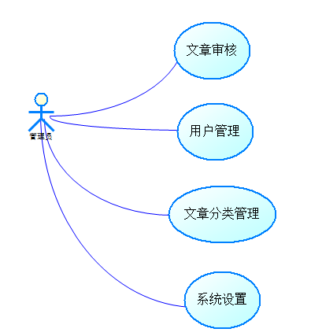
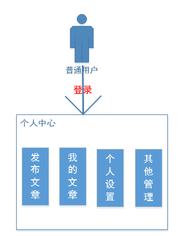
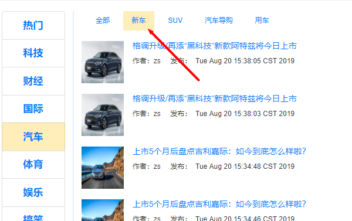

系统需求说明书

| 文档版本 | V1.0    | 文档编号 |                           |
|----------|---------|----------|---------------------------|
| 文档密级 |         | 归属部门 | 大数据学院-北京专高教研室 |
| 系统名称 | CMS系统 | 子系统名 |                           |
| 编写人   | 杨春波  | 编写日期 | 2019-7-10                 |

简介
====

目的
----

此文档的目的主要是清晰、有层次的定义原型中各个模块的内容来源和相关逻辑

目标人群及内容范围
------------------

此文档主要描述CMS项目PC端页面涉及的功能点、以及部分交互细节。本文档的主要读者为前端工程师以及后端工程师。

用户角色描述
------------

| 用户角色   | 用户描述                                                                    |
|------------|-----------------------------------------------------------------------------|
| 非注册用户 | 仅限浏览系统相关信息                                                        |
| 注册用户   | 具有浏览、评论、点赞、分享、回答、收藏,发布等权限，可申请专栏，不可发布专栏 |
| 专栏用户   | 可发布专栏(拓展模块)                                                        |
| 管理员     | 可对平台所有信息进行管理，有屏蔽、删除权限                                  |

系统概述
========

系统概述
--------

CMS是Content Management System的缩写，意为"内容管理系统,是一种位于WEB 前端（Web
服务器）和后端办公系统或流程（内容创作、编辑）之间的软件系统。内容的创作人员、编辑人员、发布人员使用内容管理系统来提交、修改、审批、发布内容。这里指的“内容”可能包括文件、表格、图片、数据库中的数据甚至视频等一切你想要发布到Internet网站的信息。

内容管理还可选地提供内容抓取工具，将第三方信息来源，比如将文本文件、HTML网页、Web服务、关系数据库等的内容自动抓取，并经分析处理后放到自身的内容库中。

随着个性化的发展，内容管理还辅助WEB前端将内容以个性化的方式提供给内容使用者，即提供个性化的门户框架，以基于WEB技术将内容更好地推送到用户的浏览器端。

系统技术支撑
------------

系统运行流程
------------

参见各版块

功能摘要
--------

| 登录 注册  | 登录       | 用户通过用户名+密码的形式登录网站                     |                                                                                                                       |
|------------|------------|-------------------------------------------------------|-----------------------------------------------------------------------------------------------------------------------|
|            | 注册       | 用户名+用户附属信息+密码的形式注册网站                |                                                                                                                       |
|            | 找回密码   | 用户可以通过绑定的邮箱找回网站密码(拓展模块)          |                                                                                                                       |
| 网站 首页  | logo       | 点击logo可返回网站首页（即头条页面）                  |                                                                                                                       |
|            | 导航       | 点击导航各个板块可进入对应页面                        |                                                                                                                       |
|            | 搜索       | 点击搜索输入关键词后，通过回车（Enter）搜索(小二使用) |                                                                                                                       |
|            | 发布       | 点击发布按钮可以发布头条                              |                                                                                                                       |
|            | 个人中心   | 显示用户头像，点击可进入个人中心                      |                                                                                                                       |
| 网站 首页  | 分类       | 显示所有资讯分类列表（可在后台进行分类的增删改查）    |                                                                                                                       |
|            | 轮播       | 显示系统推荐文章（可在后台进行设置）                  |                                                                                                                       |
|            | 资讯列表   | 列表                                                  | 显示系统推荐的文章列表(拓展)                                                                                          |
|            |            | 关注                                                  | 点击关注按钮可对文章作者进行关注(拓展)                                                                                |
|            |            | 不感兴趣                                              | 点击不感兴趣后，系统将不推荐该类型文章(拓展)                                                                          |
| 详情页     | 主体       | 标题                                                  | 显示文章的标题                                                                                                        |
|            |            | 作者                                                  | 显示文章的作者                                                                                                        |
|            |            | 时间                                                  | 显示该文章发布时间（如修改则显示最后修改时间）                                                                        |
|            |            | 收藏                                                  | 点击收藏后收藏数+1                                                                                                    |
|            |            | 正文                                                  | 显示文章正文                                                                                                          |
|            | 评论       | 可发布评论也可以回复别人的评论                        |                                                                                                                       |
|            | 侧栏(拓展) | 作者                                                  | 显示作者基本信息（头像、名称、最近发布的5篇文章）点击关注按钮可以关注该作者，关注后当作者发布新文章后会在通知栏中显示 |
|            |            | 热门推荐                                              | 显示系统推荐的文章列表（5条）                                                                                         |
|            |            | 热门吐槽                                              | 显示吐槽板块中热门吐槽（5条）                                                                                         |
| 发布 头条  | 标题       | 用于输入专栏标题（限30字内）                          |                                                                                                                       |
|            | 标题图片   | 上传文章标题图片                                      |                                                                                                                       |
|            | 分类       | 用于选择文章所属分类                                  |                                                                                                                       |
|            | 标签       | 用于输入标签（标签可用于文章推荐和搜索）(拓展)        |                                                                                                                       |
|            | 正文       | KindEditor 编辑器                                     |                                                                                                                       |
| 个人 中心  | 我的主页   | 主页                                                  | 展示用户动态/提问的基本信息，详细信息需要到详细页面进行查看                                                           |
|            |            | 我的文章                                              | 展示用户所有在平台中的回答并按时间降序进行排列                                                                        |
|            |            | 我的评论                                              | 展示用户在平台中所有分享并按时间降序进行排列(拓展)                                                                    |
|            |            | 我的关注                                              | 展示用户在平台中关注的问题和标签(拓展)                                                                                |
|            |            | 我的收藏                                              | 展示用户所有浏览的记录并按时间降序进行排列，可以通过点击清空按钮进行清空(拓展)                                        |
|            |            | 账号设置                                              | 用户可以通过该页面管理自己账号相关内容，上传头像等                                                                    |
| 管理员后台 | 栏目分类   | 管理员可以管理                                        |                                                                                                                       |
|            | 用户管理   | 用户停用或启用                                        |                                                                                                                       |
|            | 文章管理   | 审核文章,设置热门文章                                 |                                                                                                                       |

系统特性
========

登录注册
--------

### 模块简介

用户注册\\登录后可发布文章,点赞,收藏等功能

### 业务流程

### 模块触发条件

当用户点击注册登录按钮时会触发注册登录流程或者用户在未登录情况下在头条板块进行发布、点赞、收藏操作；在问答板块进行回答、点赞、提问、评论、收藏、添加标签操作；在活动版块点击我想参加、立即报名、评论操作；在交友板块发布邀约、点击喜欢、不喜欢、私信按钮、完善信息操作；在吐槽板块评论、点赞、收藏操作；在招聘页面收藏、投简历操作
以上几个操作会触发注册登录条件。

### 原型页面-注册页面

说明:

注册新用户时需要满足一下要求:

-   用户名不能为空,长度在2\~4之间

-   密码\>=6位

-   重复密码和密码保持一致

-   前后台都需要校验

### 原型页面-登录页面

说明:

登录时需要满足一下要求:

-   用户名不能为空

-   密码不能为空

-   前后台都需要校验

-   被管理员禁用的用户不能登录

管理员中心
----------

### 模块简介

此模块是系统管理员的核心模块,主要功能点如下:

### 业务流程

### 模块触发条件

当管理员登录时触发

### 原型页面-主页面

### 原型页面-文章管理

### 原型页面-文章详情

### 原型页面-用户管理

说明:点击正常\\禁用按钮相互切换,后台改变用户的状态

个人中心
--------

### 模块简介

此模块是注册用户的中心页面,在该页面用户可以:

### 业务流程

说明:注册用户登陆以后进入个人中心

### 模块触发条件

当用户发布文章,查看我的文章或者是修改个人信息时,需要进入个人中心

### 原型页面-框架页面

### 原型页面-发布文章

### 原型页面-我的文章

### 原型页面-文章详情

当点击文章列表时,查看进入文章详情

CMS首页
-------

### 模块简介

此模块是CMS 系统的核心展示模块,通过栏目\\分类展示不同的文章,

展示最新的文章,展示热点文章,轮播展示广告等内容.

-   需要特别说明是:在该模块展示的文章必须是通过管理员审核通过的.

### 业务流程

### 模块触发条件

注册或非注册用户通过输入地址查看某栏目\\分类下的文章,热点文章等

### 原型页面-框架主页面

### 原型页面-热门

默认显示热门文章

### 原型页面-栏目分类文章

说明:显示该栏目下所有的分类,默认显示栏目下所有的文章,点击小分类可查看具体分类下的文章

### 原型页面-文章详情

