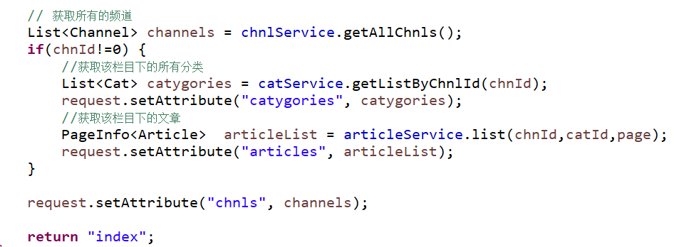
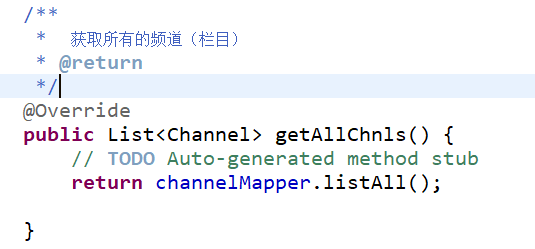
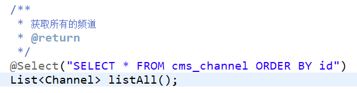
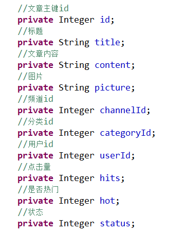
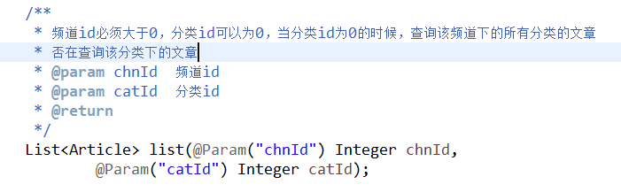
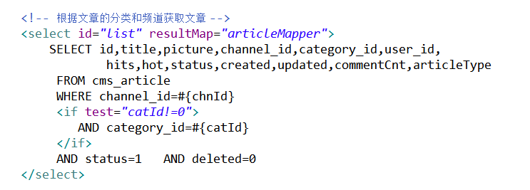
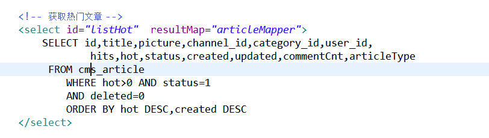
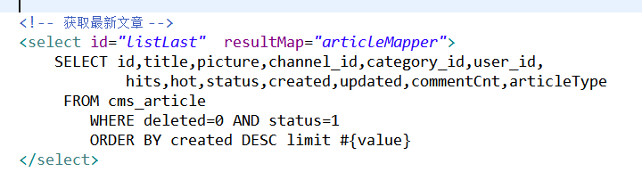

首页栏目及分类

16.1 首页概览
----

首页是最复杂的一部分，首页往往是显示的内容庞杂，相互之间可能没有关联关系。

实现效果如下所示： 

 

 


## 16.2 前端

### 16.2.1 要求

页面使用bootstrap+ jsp
实现即可。展示的内容包含频道列表、文章分类、文章列表、热门文章、最新文章、轮播图和用户登录状态等，如果需要可以再增加友情链接等等相关内容。

频道列表使用bootstrap 的样式实现，具体代码参考：

>    <ul class="list-group">
>    
>
>   ```html
>   <ul class="list-group">
>   <li class="list-group-item text-center"><a class="channel"
>   
>    href="/index">热门</a></li>
>   
>    。。。。。。。
>   
>   </ul>
>   
>   ```
>
>   ### 16.2.2 分类列表


分类列表使用使用bootstrap的nav 和nav-item样式实现，具体代码参考：

>   ```html
>    <ul class="nav">
>   
>    <!--栏目下所有 分类 -->
>   
>    <li class="nav-item list-group-item-success"><a class="nav-link"
>   
>    href="/index?chnId=${chnId}">全部</a></li>
>   
>    <li class="nav-item "><a class="nav-link"
>   
>    href="/index?chnId=1&catId=20">CBA</a></li>
>   
>    。。。。。。。。。。。
>   
>    </ul>
>   ```
>
>   

### 16.2.3 轮播图

轮播图参考bootstap官网即可。

### 16.2.4 用户登录状态

用户如果没有登录，右上角显示注册/登录链接，如果已经登录则显示用户的头像并且可以下拉菜单能够进入个人中心、退出系统等。判断是否登录的方式可以判断session中是否存在用户信息即可。这里的代码实现参考如下：


>   ```jsp
>    <ul class="nav">
>   
>    <c:choose>
>   
>    <%-- 登录显示用户菜单 --%>
>   
>    <c:when test="${sessionScope.SESSION_USER_KEY != null}">
>   
>    <li class="nav-item">
>   
>    <a class="nav-link" href="/my/home">
>   
>        style="max-height: 2.5rem" class="rounded img-fluid">
>   
>    </a>
>   
>    </li>
>   
>    <li class="nav-item">
>   
>    <div class="dropdown" style="padding-top: 0.4rem;">
>   
>    <a href="#" class="nav-link dropdown-toggle" role="button"
>    id="dropdownMenuButton" data-toggle="dropdown" aria-haspopup="true"
>    aria-expanded="false">
>   
>    <c:out value="${sessionScope.SESSION_USER_KEY.username}"
>    default="CMS-User"/>
>   
>    </a>
>   
>    <div class="dropdown-menu dropdown-menu-right"
>    aria-labelledby="dropdownMenuButton">
>   
>    <a class="dropdown-item" href="/">返回首页</a>
>   
>    <c:if test="${sessionScope.SESSION_USER_KEY.role==1}">
>   
>    <a class="dropdown-item" href="/admin/index">后台管理</a>
>   
>    </c:if>
>   
>    <c:if test="${sessionScope.SESSION_USER_KEY.role==0}">
>   
>    <a class="dropdown-item" href="/user/home">个人主页</a>
>   
>    </c:if>
>   
>    <a class="dropdown-item" href="#">个人设置</a>
>   
>    <a class="dropdown-item" href="#">我的文章</a>
>   
>    <div class="dropdown-divider"></div>
>   
>    <a class="dropdown-item" href="/user/logout">退出</a>
>   
>    </div>
>   
>    </div>
>   
>    </li>
>   
>    </c:when>
>   
>    <c:otherwise>
>   
>    <%-- 未登录显示登录注册链接 --%>
>   
>    <li class="nav-item"><a class="nav-link"
>    href="/user/register">注册</a></li>
>   
>    <li class="nav-item"><a class="nav-link"
>    href="/user/login">登录</a></li>
>   
>    </c:otherwise>
>   
>    </c:choose>
>   
>    </ul>
>   
>    </nav>
>   
>   ```
>
>   ## 16.3 后端 


### 16.3.1 控制层

获取首页数据，首页数据的获取包含栏目列表，当前栏目的分类以及当前栏目或分类下的文章列表。

为此定义Controller的函数为： 

 

而函数中的具体实现如下：

 

### 16.3.2 服务层

在首页中需要调用多个服务，主要有频道、分类、和文章，其中文章需要做分页处理。

##### 频道服务


 


##### 分类服务

 

##### 文章列表

 

##### 热门文章

 

##### 获取最新文章


### 16.3.3 数据层

##### 	频道

 

##### 	分类

 

##### 	文章

>   ​          实体Bean主要属性如下：

 

>      数据查询接口定义格式为：

 

>   对应的映射文件以及sql语句

 

>   根据频道或者分类获取文章列表的sql语句：

 

>   获取热门文章：

 

>   获取最新文章：

 
