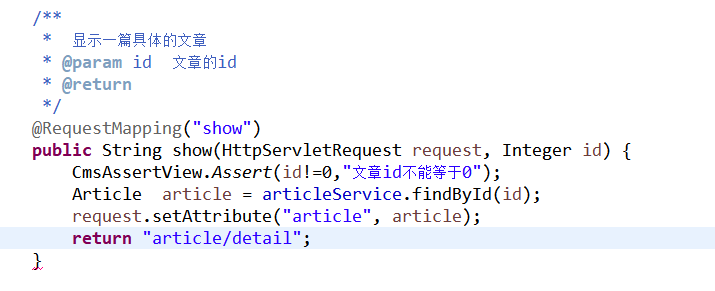
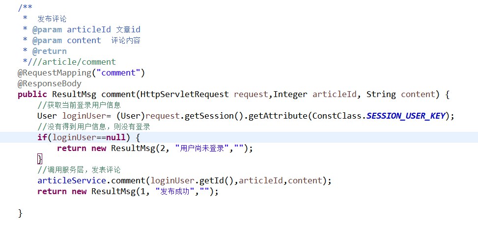
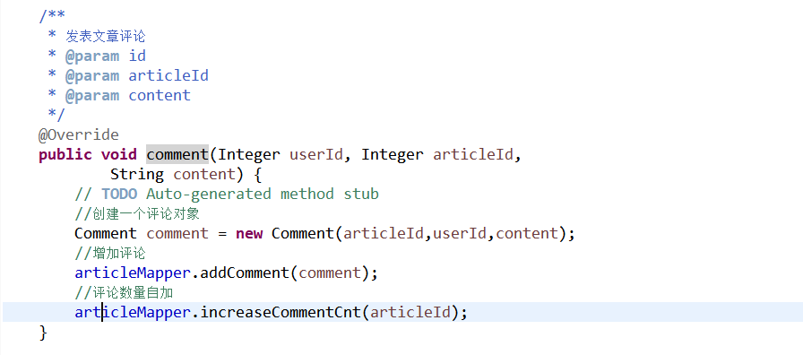
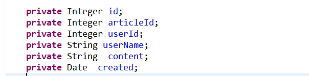

文章详情
--------

17.1 前端
----

>   文章列表中点击文章标题的链接，在新窗口打开文章的详情页面。

### 17.1.1 内容

>   标题、作者、内容、发布时间、所属分类以及评论内容和数量等。

### 17.1.2 操作

>   关闭页面

>   发表评论

>   评论翻页
>
>   

>   具体的实现方式：

### 17.1.3 关闭页面

>   \<dt\>\<a href=*"javascript:window.close()"*\>关闭窗口\</a\>\</dt\>

### 17.1.4 评论

>   显示评论使用异步刷新的方式实现，这里要求评论按照时间倒序排列显示。首先试图代码中创建一个div，在页面的加载完成后js的加载函数中调用使用div的load方法加载评论内容。实现方法如下：

>   Div的写法

>   \<dd\>\
\</div\>\</dd\>

>   预加载的写法：

\$("\#commentList").load("/article/getclist?articleId=\${article.id}" );

>   发表评论使用ajax异步提交的方式实现，在提交发布成功以后需要局部刷新评论内容。具体js代码参考如下：

>   /\*\*

>   \* 发表评论

>   \*/

>   **function** commnent(){

>   //获取评论内容

>   **var** retext=\$("[name='content']").val();

>   //获取评论的id

>   **var** id=\${article.id}

>   //评论内容不为空才可以发表

>   **if**(retext!=""){

>   \$.ajax({

>   type:"post",//请求的方式

>   data:{content:retext,articleId:id},//请求的参数

>   url:"/article/comment",//请求地址

>   success:**function**(msg){ //成功后回调

>   **if**(msg.result==1){

>   alert("发表成功")

>   //刷新评论列表

>   \$("\#commentList").load("/article/getclist?articleId=\${article.id}" );

>   }**else**{

>   //提示失败的原因

>   alert(msg.errorMsg)

>   }

>   }

>   })

>   }**else**{

>   alert("请输入评论内容")

>   }

>   }

## 17.2 后端

### 17.2.1 控制层

>   获取文章详情

>   获取文章的评论

>   发表评论

### 17.2.1 服务层

>   获取文章详情

>   获取评论列表

>   发表评论

>   发表评论后，需要对文章的评论数量做自加的操作。

### 17.2.3 数据层

>   文章的实体Bean参考首页，不在赘述。

>   评论的实体Bean主要如下：

>   主要SQL代码参考：

>   文章详情：

>   /\*\*

>   \*

>   \* **\@param** articleId

>   \* **\@return**

>   \*/

>   Article findById(Integer articleId);

>   \<!-- 获取一篇具体文章 --\>

>   \<select id=*"findById"* resultMap=*"articleMapper"*\>

>   SELECT id,title,picture,content,channel_id,category_id,user_id,

>   hits,hot,status,created,updated,commentCnt,articleType

>   FROM cms_article

>   WHERE id=\#{value}

>   AND deleted=0

>   \</select\>

>   添加评论：

>   \@Insert("INSERT INTO cms_comment(userId,articleId,content,created) "

>   \+ "VALUES(\#{userId},\#{articleId},\#{content},now() )")

>   **void** addComment(Comment comment);

>   文章评论数量自增：

>   \@Update(" UPDATE cms_article SET commentCnt=commentCnt+1 WHERE
>   id=\#{value}")

**void** increaseCommentCnt(Integer articleId);

>   获取一篇文章的评论：

>   \@Select("SELECT c.\*,u.username as userName FROM cms_comment c "

>   \+ " LEFT JOIN cms_user u ON u.id=c.userId "

>   \+ " WHERE c.articleId=\#{value} ORDER BY id desc")

>   List\<Comment\> getCommnentByArticleId(Integer articleId);
