第一单元Maven 入门
==================


【授课重点】
============

1.  Maven介绍，安装，配置，常用命令；
2.  Eclipse的Maven插件介绍、配置；
3.  第一个Maven程序；
4.  Eclipse中来执行maven命令；

【考核要求】
============

1.  maven命令

2.  maven项目的目录结构

3.  maven对项目管理的好处

4.  Jdk的配置,maven的配置

【教学内容】
============

1.1 课程导入
--------

>   1、在前面学习的过程中，需要jar包，需要手动拷贝。

>   2、jar版本的管理？

>   3、如何打包？ 如果自己的打包供他人使用？

1.2 Maven介绍
---------

Maven是Apache 下开源的、纯java开发的一个项目管理工具。使用Maven
对项目进行构建、依赖管理。

### 1.2.1 什么是项目构建

项目构建是一个项目从编写代码、编译、测试、运行、打包、部署、运行的过程。

### 1.2.2 传统的eclipse 构建项目步骤

1.  在eclpise 中创建WEB 项目

2.  在工程中编写源代码和配置文件

3.  对源代码进行编译，即JAVA 文件编译成class 文件（一般eclipse自动编译）

4.  Junit 单元测试

5.  将工程打成war 包部署至tomcat运行

### 1.2.3 Maven 构建项目步骤

>   Maven
>   对项目的每个过程进行标准化管理，使用一个命令就可以完成一个标准过程，从而简化项目过程。

1.  compile :Java文件编译成.class文件

2.  clean : 清理class文件

3.  package :java 工程打包成jar 文件，web 工程打包成war文件

4.  tomcat7:run 运行一个web工程

### 1.2.4 什么是依赖管理

-   什么是依赖

>   一个java 项目需要第三方的JAR 支持，才能运行，那么该项目就依赖的了第三方jar
>   包

-   什么是依赖管理

>   对项目依赖的JAR 包进行规范化管理.

### 1.2.5 传统项目和maven项目管理比较

-   传统项目

需要人工添加相关第三方的jar到项目中，这样可能存在的问题

1.  没有对Jar 包版本的统一进行管理，容易造成版本冲突

2.  Jar 包不容易找到

3.  Jar 包添加到工程中，导致工程过大

-   Maven 项目

>   Maven 项目不需要手工添加jar 到项目中，开发人员只需要维护pom.xml配置文件，
>   在配置文件中维护jar包的坐标，maven会自动从仓库中下载jar、运行。

好处：

1.  Pom.xml 中版本统一，不会出现冲突的问题

2.  Maven 团队维护jar 文件，当前使用jar 包，maven仓库中都有，使用方便。

### 1.2.6 使用maven 的好处

1.  依赖管理

2.  一步构建

3.  Maven 跨平台，可在windows,linux上运行

4.  Maven 遵循开发规范，有利于提高大型团队的开发效率，降低维护成本

1.2 Maven 安装与配置
----------------

### 1.2.1 下载安装

-   下载路径<http://maven.apache.org/>

-   解压到不含中文和空格的目录

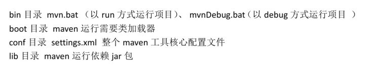

### 1.2.2 配置maven环境变量

-   设置环境变量

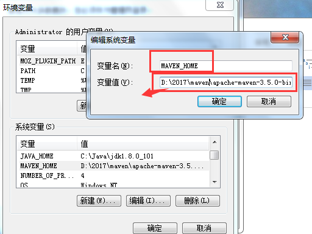

>   命令行下执行

>   echo %M2_HOME%

查看结果


-   添加到path

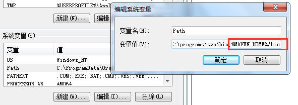

-   测试

>   运行 cmd进入,输入mvn –v 如果提示下图，则配置成功

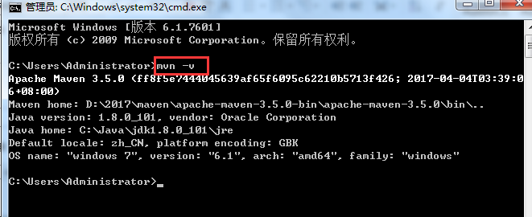

1.3 Maven 工作流程
--------------

### 1.3.1 流程图


### 1.3.2 流程描述

maven 解析 在pom.xml 文件，根据坐标去本地仓库（local repository）中找寻需要的jar
,如果本地仓库中没有，则自动通过互联网去远程仓库（remote repository）中下载需要的
jar 到本地仓库中。本地仓库可以理解为缓存.

如果要想从外网上下载，需要


1.4 maven仓库分类
-------------

### 1.4.1 仓库之间工作流程

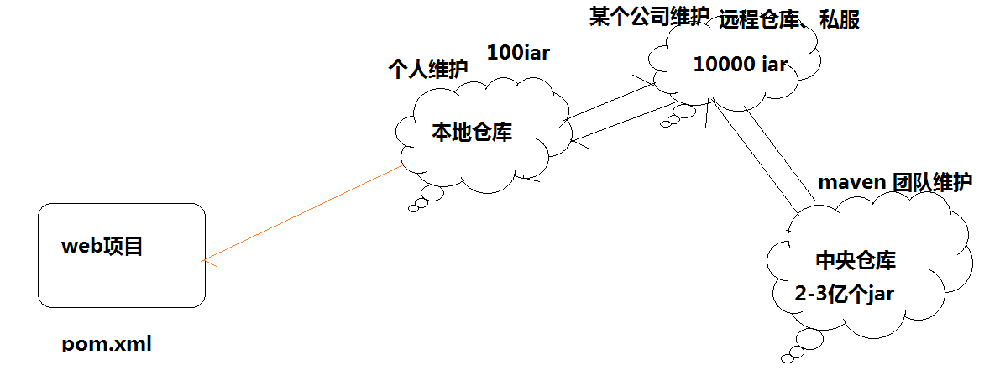

### 1.4.2 本地仓库

用来存储从远程仓库或中央仓库下载的jar 包. 项目中使用的jar， 从本地仓库中查找。

本地仓库默认位置：

\${user.home}/.m2/repository \${user.home}代表为当前windows用户

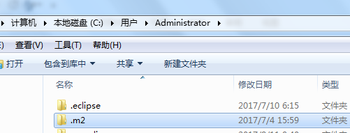

### 1.4.3 远程仓库

如果本地仓库没有需要的jar,则去远程仓库查找。远程仓库可以在局域网内，也可以在局域网外。

远程仓库可以理解为公司的私服，该仓库中的jar
有所在公司的人维护，服务于具体某个公司或组织。

### 1.4.4 中央仓库

在maven中设置一个远程仓库地址http://respo1.maven.org/maven2,

中央仓库服务与整个互联网，它是由Maven 团队维护，里面包含了非常全的jar 包。

### 1.4.5 配置本地仓库地址


>   在maven 的安装路径的 conf 下设置settings.xml

>   \<localRepository\>D:\\2017\\maven\\repository\</localRepository\>

>   表示本地的仓库地址为D:\\2017\\maven\\repository 该路径下

1.6 Maven 快速入门
--------------

### 1.6.1 学习重点

-   Maven的 目录结构是什么

-   Maven 常用的命令有哪些

### 1.6.2 Maven 项目目录规范

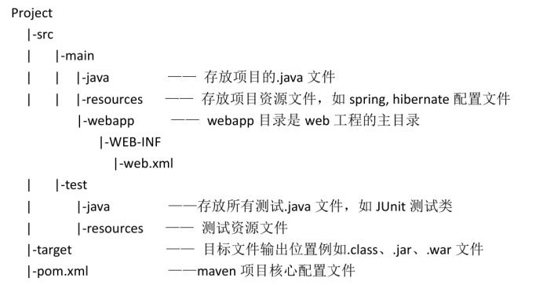

### 1.6.3 Maven 常用命令

依据上述目录规范创建一个web项目，

#### compile

Compile 是maven 编译命令,作用是将src/main/java
下的文件编译为.class文件输出到target目录下

进入项目根目录，执行 mvn compile


查看target 目录，编译文件已经生成

#### test

Test为maven 单元测试类，会运行src/java/test 下的类，

在cmd 中输入 mvn test


#### clean

Clean为 maven 的清除命令。执行该命令会清除target目录的内容

#### package

Package为maven 的打包命令，Java 项目打成jar,web项目打成war 包

#### install 

发布命令，将项目打成jar 或war 发布到本地仓库中

#### deploy

发布命令，将项目打成jar 或war 发布到远程仓库(私服)

1.7 Maven的概念模型
---------------

### 1.7.1 项目对象模型

一个maven 项目对应一个pom.xml
文件，通过pom.xml文件定义项目的坐标、项目依赖、项目信息等

### 1.7.2 项目依赖管理系统

通过maven 的项目依赖管理，对项目所依赖的jar包统一管理。

上边的项目依赖junit jar，通过在pom.xml中配置junit 依赖。

```xml
<?xml version="1.0" encoding="utf-8"?>

<!-- 项目依赖 集合-->
<dependencies> 
  <!--单个依赖 -->  
  <dependency> 
    <!-- 依赖的组织或模块 -->  
    <groupId>*junit*</groupId>  
    <!-- -依赖的模块 -->  
    <artifactId>*junit*</artifactId>  
    <!-- 依赖的模块版本 -->  
    <version>4.9</version>  
    <!-- 依赖的范围 -->  
    <scope>test</scope> 
  </dependency> 
</dependencies>
```


1.8 Maven 在eclipse 中使用配置
--------------------------

Eclipse 中已经集成了maven ,所以不需要单独安装了。但是需要一些设置

### 1.8.1 指定maven 的安装路径

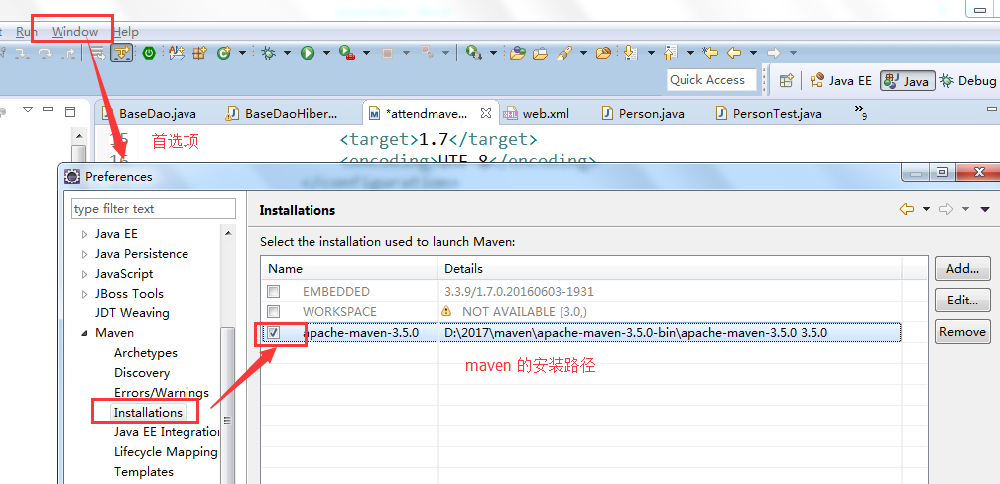

### 1.8.2 User settings的设置


### 1.8.3 Eclipse 浏览仓库

Window –showview –other


### 1.8.5 Maven坐标定义

坐标是maven 对jar 包的身份定义，所以每个maven 项目都需要定义本工程的坐标。如：

```xml
    <!—项目名称 -->
    <!-- 公司名称或组织名称 -->
  <groupId>com.hrxb</groupId>
  <!-- 项目或模块名称 -->
  <artifactId>attendmaven</artifactId>
  <!-- 项目或模块版本 -->
  <version>0.0.1-SNAPSHOT</version>
  <!-- 项目或模块的打包类型
  war： web项目
  jar :Java项目
  pom:父工程设置为pom
   -->
  <packaging>war</packaging>
```


1.9 Maven构建web 工程
-----------------

### 1.9.1 业务需求

创建一个web 工程，使用struts2
实现，在浏览器输入http://127.0.0.1:8080/maven/helloMaven 页面跳转到 index.jsp
页面并显示 hello maven.

### 1.9.2 开发步骤

1.  新建项目 other ，创建maven project

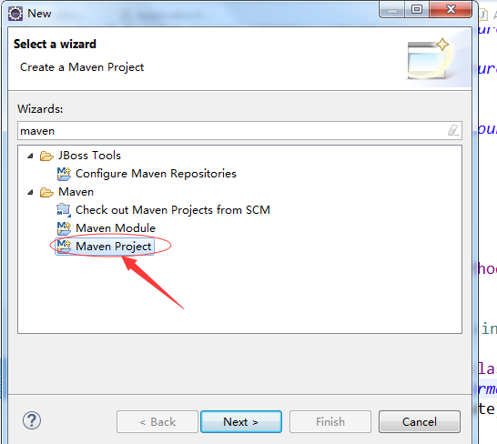

1.  跳过模板选择如下图

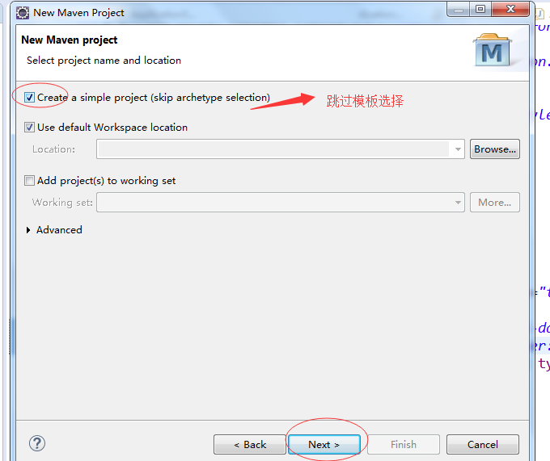

1.  定义坐标

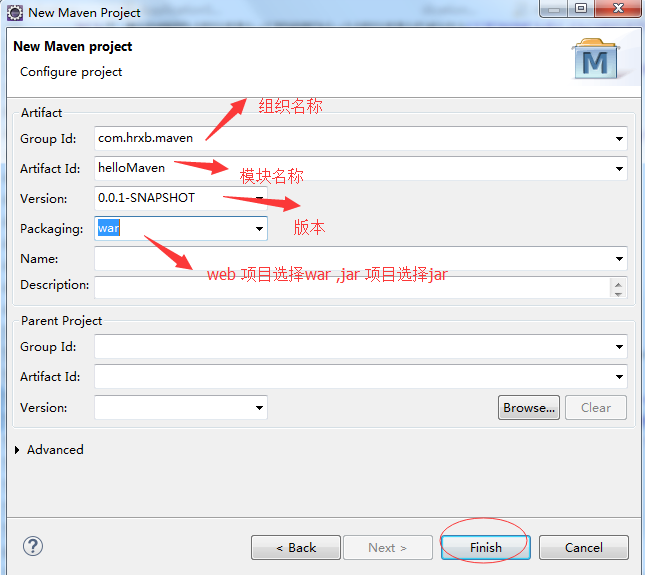

1.  点finish后形成的结果如下图


1.  处理项目错误

>   Maven 默认不会创建web.xml文件，需要手工创建，注意需要在WEB-INF 下创建
>   web.xml ,如下图

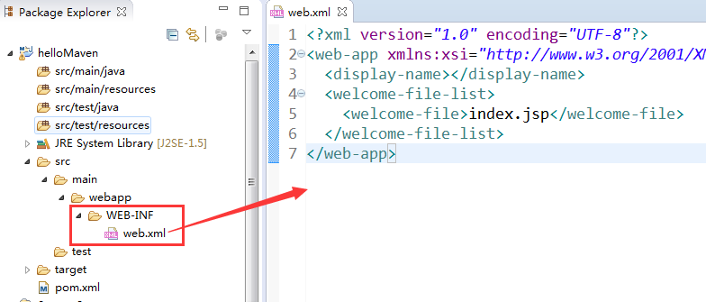

也可以用eclipse自动生成 .如下:


1.  处理设置项目的编译版本

>   项目创建好以后，默认的编译版本为1.5，本教程使用jdk8，所以需要重新设置编译的版本为Jdk8

，需要在pom.xml 中加入

​	

```xml
<build>

	<plugins>

			<plugin>				 

<groupId>org.apache.maven.plugins</groupId>

				<artifactId>maven-compiler-plugin</artifactId>

				<version>3.5.1</version>  

				<configuration>

					<source>1.8</source>

					<target>1.8</target>

					<encoding>UTF-8</encoding>

				</configuration>

			</plugin>

		</plugins>

	</build>
```


```xml

```


>   右键项目—maven—update project

1. 使用pom.xml 加入struts2 需要的相关jar，向pom.xml中添加依赖

   ​	

   ```xml
   <dependencies>
     	<dependency>
     		<groupId>org.apache.struts</groupId>
     		<artifactId>struts2-core</artifactId>
     		<version>2.3.24</version>
     	</dependency>
     </dependencies>
   ```

   ```xml
   
   ```

   


添加完以后，项目目录出现

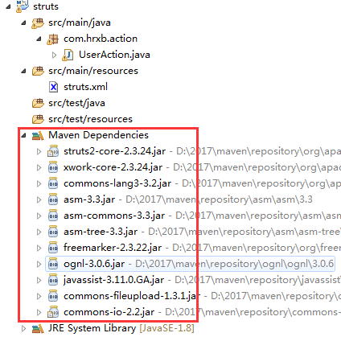

1.  开发action

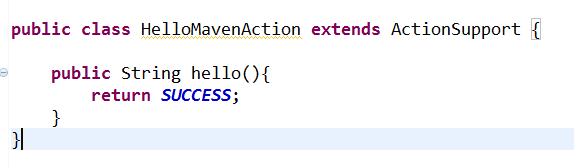

1.  配置struts.xml文件

>   在src/main/resources 下加入struts.xml文件。如下

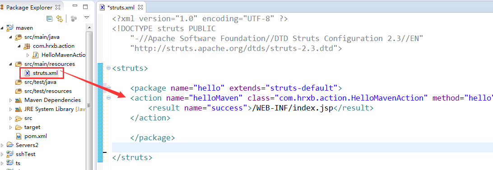

1.  开发jsp  
    

    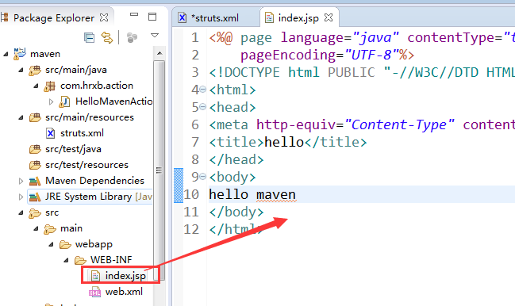

2.  由于 Java 8和tomcat6 不兼容。所以项目要用tomcat 7
    或更高版本来运行。需要单独加入tomcat7 或更高的 插件.否则会报下面的错误

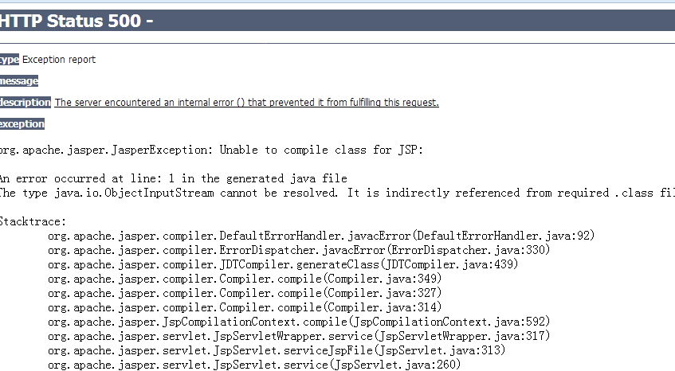

>   解决办法：在pom.xml中加入

| \<plugin\> \<groupId\>org.apache.tomcat.maven\</groupId\> \<artifactId\>tomcat7-*maven*-*plugin*\</artifactId\> \<version\>2.2\</version\> \</plugin\> |
|--------------------------------------------------------------------------------------------------------------------------------------------------------|


1.  运行tomcat

>   右键项目 run as


1.  启动成功后，在地址栏输入

>   http://localhost:8080/maven/helloMaven

1.10 eclipse 下maven 命令的使用
--------------------------


Run as 采用mvn 的命令运行 。debug as 采用mvndebug 的命令运行

Maven clean 清楚target 目录

Maven test 运行单元测试

Maven intstall 将项目打包发布到本地仓库

Maven deploy将项目打包发布到远程仓库

Maven build 运行之前操作过的命令

Maven build …手动输入命令 ，如下

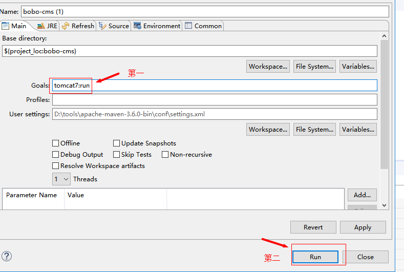
