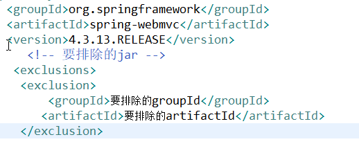
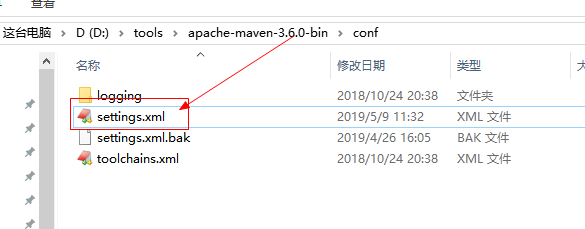

第二单元 Maven坐标体系与依赖
============================

【授课重点】
============

1.  五维坐标；

2.  依赖范围，传递，归类依赖，冲突调解，依赖排除；

3.  仓库；

【考核要求】
============

1.  坐标包含的内容

2.  依赖范围

3.  冲突解决的原则

4.  依赖范围对传递依赖的影响

【教学内容】
============

2.1 课堂导入
--------

前边已经学习了基本的使用

2.2 Maven坐标定义
-------------

坐标是maven 对jar 包的身份定义，所以每个maven 项目都需要定义本工程的坐标。如：

```xml
   <!-- 公司名称或组织名称 -->

  <groupId>com.hrxb</groupId>

  <!-- 项目或模块名称 -->

  <artifactId>attendmaven</artifactId>

  <!-- 项目或模块版本 -->

  <version>0.0.1-SNAPSHOT</version>

  <!-- 项目或模块的打包类型

  war： web项目

  jar :Java项目

  pom:父工程设置为pom

   -->

  <packaging>war</packaging>
```


2.3 依赖管理
--------

### 2.3.1 添加依赖的方式 

- 在pom.xml通过输入坐标添加依赖， 如添加spring-webmvc

     ```xml
     <dependency>
     
       		<groupId>org.springframework</groupId>
     
       		<artifactId>spring-webmvc</artifactId>
     
       		<version>4.3.13.RELEASE</version>
     
     </dependency>
     ```


-   添加依赖的另一种方式

 

### 2.3.2 查找坐标

如果不知道依赖的坐标可以通过以下方式:

1.  在互联网<http://www.mvnrepository.com/>

 

 

### 2.3.3 依赖范围

传统的eclipse 构建项目过程如下

Compile: 编译 、测试、运行、打包 如spring 核心包 默认级别

Provided :编译、测试 需要；运行 、打包不需要 。如servlet-api.jar

Runtime: 编译不需要，测试、运行、打包需要 如数据库驱动包，编译时如果没有提供该
jar 包，程序也不会报错。

Test：编译，测试需要，运行，打包不需要 junit

system:系统范围，与provided类似，只是标记为该scope的依赖包需要明确指定基于文件系统的jar包路径。因为需要通过systemPath指定本地jar文件路径，所以该scope是不推荐的

### 2.3.4 依赖传递

在pom.xml 配置只spring-webmvc ，那么和spring-webmvc
相互依赖的包也会被引用过来。如

 

通过pom.xml中的下列操作  

 

2.4 Jar 包冲突的解决办法
---------------------

### 2.4.1 Jar 包冲突的原因

MAVEN项目运行中如果报如下错误：

Caused by:java.lang.NoSuchMethodError

Caused by: java.lang.ClassNotFoundException

很有可能Maven jar包冲突造成的。那么jar包冲突是如何产生的？

假如存在以下依赖关系:

| A-\>B-\>C-\>D1(log 15.0)：A中包含对B的依赖，B中包含对C的依赖，C中包含对D1的依赖，假设是D1是日志jar包，version为15.0 E-\>F-\>D2(log 16.0)：E中包含对F的依赖，F包含对D2的依赖，假设是D2是同一个日志jar包，version为16.0 |
|-----------------------------------------------------------------------------------------------------------------------------------------------------------------------------------------------------------------------|
| 当pom.xml文件中引入A、E两个依赖后，根据Maven传递依赖的原则，D1、D2都会被引入，而D1、D2是同一个依赖D的不同版本。                                                                                                       |

当我们在调用D2中的method1()方法，而D1中是15.0版本（method1可能是D升级后增加的方法），可能没有这个方法，这样JVM在加载A中D1依赖的时候，找不到method1方法，就会报NoSuchMethodError的错误，此时就产生了jar包冲突。

### 2.4.2 解决办法

-   最短路径优先

Maven 面对 D1 和 D2 时，会默认选择最短路径的那个 jar 包，即 D2。E-\>F-\>D2 比
A-\>B-\>C-\>D1 路径短 1。

-   最先声明优先

如果路径一样的话，如： A-\>B-\>C1, E-\>F-\>C2 ，两个依赖路径长度都是
2，那么就选择最先声明

-   锁定原则

一般用在用多模块开发,在父项目中,声明需要的版本

### 2.4.3 排除冲突的jar

#### 2.4.3.1 工具排除

使用Maven Helper插件中的Dependency
Analyzer分析冲突的jar包，然后在对应标红版本的jar包上面点击execlude，就可以将该jar包排除出去

#### 2.4.3.2 手工排除

 

**案例**:

| 配置spring-context(4.3.13)的jar包依赖 配置spring-struts 的jar（3.0.5）包依赖 通过排除的方法,排除3.0.5版本的spring-beans |
|-------------------------------------------------------------------------------------------------------------------------|
|                                                                                                                         |

2.5 maven仓库分类
-------------

### 2.5.1 仓库之间工作流程

 

### 2.5.2 本地仓库

用来存储从远程仓库或中央仓库下载的jar 包. 项目中使用的jar， 从本地仓库中查找。

本地仓库默认位置：

\${user.home}/.m2/repository \${user.home}代表为当前windows用户

 

### 2.5.3 远程仓库

如果本地仓库没有需要的jar,则去远程仓库查找。远程仓库可以在局域网内，也可以在局域网外。

远程仓库可以理解为公司的私服，该仓库中的jar
有所在公司的人维护，服务于具体某个公司或组织。

### 2.5.4 中央仓库

在maven中设置一个远程仓库地址http://respo1.maven.org/maven2,

中央仓库服务与整个互联网，它是由Maven 团队维护，里面包含了非常全的jar 包。

### 2.5.5 配置本地仓库地址

 

 

在maven 的安装路径的 conf 下设置settings.xml,如上图


