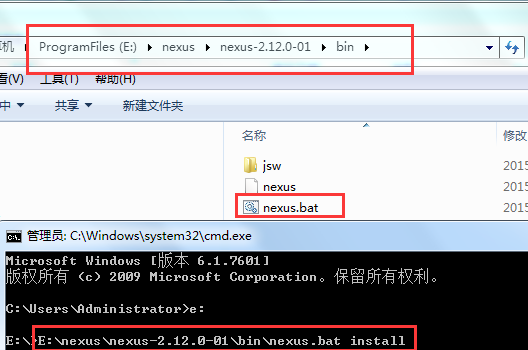

第四单元 Maven项目生命周期、插件、发布
======================================

【授课重点】
============

1.  理解maven的生命周期

2.  maven的私服搭建

3.  发布组件到私服以及从私服获取组件

4.  插件的使用

【考核要求】
============

1.  maven的生命周期 以及和命令的对应关系

2.  nexus私服的介绍

3.  发布需要配置哪些内容

【教学内容】
============

 4.1 课堂导入
---------

 4.2 生命周期
---------

Maven生命周期就是为了对所有的构建过程进行抽象和统一，包括项目清理、初始化、编译、打包、测试、部署等几乎所有构建步骤，生命周期可以理解为构建工程的步骤。

在Maven中有三套相互独立的生命周期，请注意这里说的是“三套”，而且“相互独立”，这三套生命周期分别是：

Clean Lifecycle： 在进行真正的构建之前进行一些清理工作。

Default Lifecycle： 构建的核心部分，编译，测试，打包，部署等等。

Site Lifecycle： 生成项目报告，站点，发布站点。

### 4.2.1  Clean生命周期：清理项目

Clean生命周期一共包含了三个阶段：

- pre-clean 执行一些需要在clean之前完成的工作 
- clean 移除所有上一次构建生成的文件 
- post-clean 执行一些需要在clean之后立刻完成的工作 


也就是说，mvn clean 等同于 mvn pre-clean clean

如果我们运行 mvn post-clean ，那么 pre-clean，clean 都会被运行。

这是Maven很重要的一个规则，可以大大简化命令行的输入。

### 4.2.2 Default生命周期：构造项目

-   Default生命周期是Maven生命周期中最重要的一个，绝大部分工作都发生在这个生命周期中。这里，只解释一些比较重要和常用的阶段


- validate 

  generate-sources 

  process-sources 

  generate-resources 

  process-resources 复制并处理资源文件，至目标目录，准备打包。 

  **compile** 编译项目的源代码。 

  process-classes 

  generate-test-sources 

  process-test-sources 

  generate-test-resources 

  process-test-resources 复制并处理资源文件，至目标测试目录。 

  test-compile 编译测试源代码。 

  process-test-classes 

  **test** 使用合适的单元测试框架运行测试。这些测试代码不会被打包或部署。 

  prepare-package 

  **package** 接受编译好的代码，打包成可发布的格式，如 JAR 。 

  pre-integration-test 

  integration-test 

  post-integration-test 

  verify 

  **install** 将包安装至本地仓库，以让其它项目依赖。 

  deploy 将最终的包复制到远程的仓库，以让其它开发人员与项目共享

-   

- **运行任何一个阶段的时候，它前面的所有阶段都会被运行**

- 这也就是为什么我们**运行mvn install
  的时候，代码会被编译，测试，打包，安装到本地仓库**

- 此外，Maven的插件机制是完全依赖Maven的生命周期的，因此理解生命周期至关重要。

### 4.2.3 Sit生命周期：生成项目站点

-   这里经常用到的是site阶段和site-deploy阶段，用以生成和发布Maven站点，这可是Maven相当强大的功能

-   Manager比较喜欢，文档及统计数据自动生成，很好看。我们就不用学，以后自己研究

| pre-site 执行一些需要在生成站点文档之前完成的工作 site 生成项目的站点文档 post-site 执行一些需要在生成站点文档之后完成的工作，并且为部署做准备 site-deploy 将生成的站点文档部署到特定的服务器上 |
|-------------------------------------------------------------------------------------------------------------------------------------------------------------------------------------------------|


4.3 Maven插件
---------

- 可以通过pom.xml配置插件来更改项目编译compile的jdk版本

  **compile插件**


```xml
   <build>

  	<plugins>

  		<plugin>

			<groupId>org.apache.maven.plugins</groupId>

			<artifactId>maven-compiler-plugin</artifactId>

			<configuration>

				<source>1.8</source>

				<target>1.8</target>

				<encoding>UTF-8</encoding>

			</configuration>

		</plugin>

  	</plugins>
```


|      |
| ---- |
|      |
|      |

4.4 私服（远程仓库）
----------------

一般有企业的运维人员搭建


### 4.4.1 安装 nexus 




### 4.4.2 启动服务


如果启动失败，可能是java 的环境变量没有配置对。需要单独设置如下


改成：C:\\Java\\jdk1.8.0_101\\bin\\java.exe

### 4.4.3 访问nexus


访问地址为 <http://localhost:8081/nexus>

### 4.4.4 登录

登录名和密码默认为

admin / admin123


包含四种仓库类型

Virtual 虚拟仓库 ,不使用

Proxy 代理仓库 被用来代理远程的公共仓库，如maven中央仓库

Hosted 宿主/本地仓库 ，通常我们会部署自己的构件到这一类型的仓库。

Group 仓库组 （常用）

作用: 当下载jar时有该group选择从具体上边那个仓库下载

Releases:

这里存放我们自己项目中发布的构建, 通常是Release版本的, 比如我们自己做了一个FTP
Server的项目, 生成的构件为ftpserver.war,
我们就可以把这个构建发布到Nexus的Releases本地仓库. 关于符合发布后面会有介绍.

Snapshots:

　它的目的是让我们可以发布那些非release版本, 非稳定版本


4.5 私服上传和下载
--------------

### 4.5.1 上传

第一步： 需要在客户端,即部署server工程的电脑上配置 maven环境，并修改
settings.xml 文件，配置连接私服的用户和密码 。

此用户名和密码用于私服校验，因为私服需要知道上传都 的账号和密码
是否和私服中的账号和密码 一致。


```xml
 <server>
      <id>releases</id>
      <username>admin</username>
      <password>admin123</password>
    </server>
	<server>
      <id>snapshots</id>
      <username>admin</username>
      <password>admin123</password>
 </server>


```

第二步： 配置项目pom.xml

配置私服仓库的地址，jar包会上传到私服的宿主仓库，根据工程的版本号决定上传到哪个宿主仓库，如果版本为release则上传到私服的release仓库，如果版本为snapshot则上传到私服的snapshot仓库

```xml
<distributionManagement>

  	<repository>

  		<id>releases</id>

	<url>http://localhost:8081/nexus/content/repositories/releases/</url>

  	</repository> 

  	<snapshotRepository>

  		<id>snapshots</id>

	<url>http://localhost:8081/nexus/content/repositories/snapshots/</url>

  	</snapshotRepository> 

  </distributionManagement>
```


注意：pom.xml这里\<id\> 和 settings.xml 配置 \<id\> 对应！

第三步：执行deploy命令发布到私服

右键ssm_server 项目执行命令 deploy

### 4.5.2 下载

第一步 修改settings.xml

```xml


<profile>   

	<!--profile的id-->

    <id>dev</id>   

    <repositories>   

      <repository>  

		<!--仓库id，repositories可以配置多个仓库，保证id不重复-->

        <id>nexus</id>   

		<!--仓库地址，即nexus仓库组的地址-->

        <url>http://localhost:8081/nexus/content/groups/public/</url>   

		<!--是否下载releases构件-->

        <releases>   

          <enabled>true</enabled>   

        </releases>   

		<!--是否下载snapshots构件-->

        <snapshots>   

          <enabled>true</enabled>   

        </snapshots>   

      </repository>   

    </repositories>  

	 <pluginRepositories>  

    	<!-- 插件仓库，maven的运行依赖插件，也需要从私服下载插件 -->

        <pluginRepository>  

        	<!-- 插件仓库的id不允许重复，如果重复后边配置会覆盖前边 -->

            <id>public</id>  

            <name>Public Repositories</name>  

            <url>http://localhost:8081/nexus/content/groups/public/</url>  

        </pluginRepository>  

    </pluginRepositories>  

  </profile> 
```


激活 注意dev 和 profile 一致

```xml
<activeProfiles>

    <activeProfile>dev</activeProfile>

</activeProfiles>
```


第二步 删除本地仓库中jar

第三步 更新项目

4.6 附录（pom.xml）
---------------

pom文件

​	

```xml
<!-- 定义主要版本号 -->
	<properties>
		<spring.version>4.3.13.RELEASE</spring.version>
		<mybatis.version>3.4.2</mybatis.version>
		<log4j.version>1.2.17</log4j.version>
		<druid.version>1.0.9</druid.version>
		<mysql.version>5.1.6</mysql.version>
		<mybatis.spring.version>1.3.0</mybatis.spring.version>
		<jackson.version>2.8.1</jackson.version>
		<poi.version>3.9</poi.version>
		<jstl.version>1.2</jstl.version>
		<servlet-api.version>2.5</servlet-api.version>
		<jsp-api.version>2.0</jsp-api.version>
		<commons-lang3.version>3.3.2</commons-lang3.version>
		<commons-io.version>1.3.1</commons-io.version>
		<commons-net.version>3.3</commons-net.version>
		<commons-fileupload.version>1.3.1</commons-fileupload.version>
		<junit-version>4.12</junit-version>
		<!-- aop使用 -->
		<aspectj-version>1.8.0</aspectj-version>
		<!-- 分页助手 -->
		<pagehelper-version>5.1.2</pagehelper-version>

	</properties>

	<!-- 依赖管理，版本锁定 -->

	<dependencies>
		<!-- spring 及springMVC -->
		<dependency>
			<groupId>org.springframework</groupId>
			<artifactId>spring-core</artifactId>
			<!-- 引用版本 -->
			<version>${spring.version}</version>
		</dependency>
		<dependency>
			<groupId>org.springframework</groupId>
			<artifactId>spring-context</artifactId>
			<version>${spring.version}</version>
		</dependency>
		<dependency>
			<groupId>org.springframework</groupId>
			<artifactId>spring-beans</artifactId>
			<version>${spring.version}</version>
		</dependency>
		<dependency>
			<groupId>org.springframework</groupId>
			<artifactId>spring-web</artifactId>
			<version>${spring.version}</version>
		</dependency>
		<dependency>
			<groupId>org.springframework</groupId>
			<artifactId>spring-webmvc</artifactId>
			<version>${spring.version}</version>
		</dependency>
		<dependency>
			<groupId>org.springframework</groupId>
			<artifactId>spring-jdbc</artifactId>
			<version>${spring.version}</version>
		</dependency>
		<dependency>
			<groupId>org.springframework</groupId>
			<artifactId>spring-tx</artifactId>
			<version>${spring.version}</version>
		</dependency>
		<dependency>
			<groupId>org.springframework</groupId>
			<artifactId>spring-context-support</artifactId>
			<version>${spring.version}</version>
		</dependency>
		<!-- mybatis核心包 -->
		<dependency>
			<groupId>org.mybatis</groupId>
			<artifactId>mybatis</artifactId>
			<version>${mybatis.version}</version>
		</dependency>
		<!-- mybatis-spring 整合jar -->
		<dependency>
			<groupId>org.mybatis</groupId>
			<artifactId>mybatis-spring</artifactId>
			<version>${mybatis.spring.version}</version>
		</dependency>
		<!-- druid数据源 -->
		<dependency>
			<groupId>com.alibaba</groupId>
			<artifactId>druid</artifactId>
			<version>${druid.version}</version>
		</dependency>
		<!-- Mysql数据库驱动包 -->
		<dependency>
			<groupId>mysql</groupId>
			<artifactId>mysql-connector-java</artifactId>
			<version>${mysql.version}</version>
		</dependency>
		<!-- 日志文件管理包 -->
		<!-- log start -->
		<dependency>
			<groupId>log4j</groupId>
			<artifactId>log4j</artifactId>
			<version>${log4j.version}</version>

		</dependency>


		<!-- 单元测试 -->
		<dependency>
			<groupId>junit</groupId>
			<artifactId>junit</artifactId>
			<version>${junit-version}</version>
			<scope>test</scope>
		</dependency>
		<!-- 上传组件包 -->
		<dependency>
			<groupId>commons-fileupload</groupId>
			<artifactId>commons-fileupload</artifactId>
			<version>${commons-fileupload.version}</version>
		</dependency>
		<dependency>
			<groupId>commons-io</groupId>
			<artifactId>commons-io</artifactId>
			<version>${commons-io.version}</version>
		</dependency>
		<dependency>
			<groupId>org.apache.poi</groupId>
			<artifactId>poi</artifactId>
			<version>${poi.version}</version>
		</dependency>
		<!-- JSP相关 -->
		<dependency>
			<groupId>jstl</groupId>
			<artifactId>jstl</artifactId>
			<version>${jstl.version}</version>
		</dependency>
		<dependency>
			<groupId>javax.servlet.jsp</groupId>
			<artifactId>jsp-api</artifactId>
			<version>2.2</version>
			<scope>provided</scope>
		</dependency>
		<dependency>
			<groupId>javax.servlet</groupId>
			<artifactId>servlet-api</artifactId>
			<version>${servlet-api.version}</version>
			<scope>provided</scope>
		</dependency>

		<dependency>
			<groupId>com.fasterxml.jackson.core</groupId>
			<artifactId>jackson-databind</artifactId>
			<version>${jackson.version}</version>
		</dependency>

		<!-- 依赖的公共包 -->
		<dependency>
			<groupId>org.apache.commons</groupId>
			<artifactId>commons-lang3</artifactId>
			<version>${commons-lang3.version}</version>
		</dependency>

		<dependency>
			<groupId>org.aspectj</groupId>
			<artifactId>aspectjweaver</artifactId>
			<version>${aspectj-version}</version>
		</dependency>
		<dependency>
			<groupId>org.aspectj</groupId>
			<artifactId>aspectjrt</artifactId>
			<version>${aspectj-version}</version>
		</dependency>

		<!-- mybaits pagehelper 分页助手 -->

		<dependency>
			<groupId>com.github.pagehelper</groupId>
			<artifactId>pagehelper</artifactId>
			<version>${pagehelper-version}</version>
		</dependency>

		<dependency>
			<groupId>org.springframework</groupId>
			<artifactId>spring-test</artifactId>
			<version>${spring.version}</version>
		</dependency>
       <!-- 富文本编辑器使用该文件上传 -->
		<dependency>
			<groupId>com.googlecode.json-simple</groupId>
			<artifactId>json-simple</artifactId>
			<version>1.1.1</version>
		</dependency>

<!-- 依赖公共工具包 -->
		<dependency>
			<groupId>com.zhangsan</groupId>
			<artifactId>cms_common</artifactId>
			<version>0.0.1-SNAPSHOT</version>
		</dependency>
		
		<!-- md5工具包 -->
	</dependencies>


	<build>
		<plugins>
			<plugin>
				<groupId>org.apache.maven.plugins</groupId>
				<artifactId>maven-compiler-plugin</artifactId>
				<version>3.5.1</version>
				<configuration>
					<source>1.8</source>
					<target>1.8</target>
					<encoding>UTF-8</encoding>
				</configuration>
			</plugin>


			<!-- Tomcat插件：非官方插件，第三方插件，用于启动Web服务。运行命令：tomcat7:run -->
			<plugin>
				<groupId>org.apache.tomcat.maven</groupId>
				<artifactId>tomcat7-maven-plugin</artifactId>
				<version>2.2</version>
				<configuration>
				     <!-- 项目端口号 -->
					<port>80</port>
					 <!-- 项目的访问路径 -->
					<path>/</path>
					<!-- get请求中文乱码 -->
					<uriEncoding>utf-8</uriEncoding>
					<!-- 配置tomcat虚拟路径 -->
					<staticContextPath>/pic</staticContextPath>
					<!-- 配置tomcat物理路径 -->
					<staticContextDocbase>d:/pic</staticContextDocbase>
				</configuration>
			</plugin>


		</plugins>
	</build>
```

## 4.7 课堂小结

1. 讲述了maven的生命周期
2. 如何搭建maven的私服
3. 如何发布组件到私服以及从私服获取组件
4. jetty 和tomcat插件的使用

## 4.8 课堂小结

1. 搭建私服
2. 构建一个jar项目发布到本地仓库
3. 将上述项目发布到私服