第五单元 Git应用
================

【授课重点】
============

1.  版本控制的必要性，GIT概念；

2.  什么是GIT仓库；

3.  GIT基本配置和使用；

4.  GIT命令；

5.  Eclipse中使用GIT；

【考核要求】
============

1.  版本控制好处, 常用的版本控制工具

2.  仓库概念 作用

3.  Git的命令

【教学内容】
============

5.1 课程导入
--------

### 5.1.1 开发中问题

1.  回到某个历史节点

2.  团队的协作问题

### 5.1.2 什么是版本控制

版本控制是指对软件开发过程中各种程序代码、[配置文件](https://baike.baidu.com/item/%E9%85%8D%E7%BD%AE%E6%96%87%E4%BB%B6/286550)及说明文档等文件变更的管理。

版本控制最主要的功能就是追踪文件的变更。它将什么时候、什么人更改了文件的什么内容等信息忠实地了已录下来。每一次文件的改变，文件的版本号都将增加。除了记录版本变更外，版本控制的另一个重要功能是并行开发。[软件开发](https://baike.baidu.com/item/%E8%BD%AF%E4%BB%B6%E5%BC%80%E5%8F%91/3448966)往往是多人协同作业，版本控制可以有效地解决版本的同步以及不同开发者之间的开发通信问题，提高协同开发的效率。并行开发中最常见的不同版本软件的错误(Bug)修正问题也可以通过版本控制中分支与合并的方法有效地解决。

### 5.1.3 目前流行的版本软件

-   SVN

SVN是集中式的版本控制系统。集中式版本控制系统，版本库是集中存放在中央服务器的

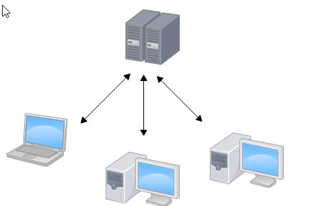

工作的时候，个人需要先从中央服务器取得最新的版本，然后开始工作，工作完成，再把个人的工作内容推送给中央服务器.

集中式版本控制系统最大的缺点就是必须联网才能工作

-   GIT

Git 是分布式版本控制软件

分布式版本控制系统的安全性要高很多，因为每个人电脑里都有完整的版本库，某一个人的电脑坏掉了不要紧，随便从其他人那里复制一个就可以了。而集中式版本控制系统的中央服务器要是出了问题，所有人都没法工作了。

Git的优势不单是不必联网这么简单，后面我们还会看到Git极其强大的分支管理。

### 5.1.4 应用场景

项目团队开发

5.2 Git概述
-------

Git是目前世界上最先进的分布式版本控制系统,Linus花了两周时间自己用C语言写了一个分布式版本控制系统

2008年，GitHub网站上线了，它为开源项目免费提供Git存储，无数开源项目开始迁移至GitHub,
地址为: <https://github.com/>

Git可以在Linux、Unix、Mac和Windows这几大平台上正常运行

国内代码托管平台: <https://gitee.com/>

 5.3 GIT 安装和配置
---------------

在Windows上使用Git，可以从Git官网直接[下载安装程序](https://git-scm.com/downloads)，然后按默认选项安装即可。

双击安装即可

安装完成后，在开始菜单里找到“Git”-\>“Git
Bash”，蹦出一个类似命令行窗口的东西，就说明Git安装成功！

安装完成后，还需要最后一步设置，因为Git是分布式版本控制系统，所以，每个机器都必须有唯一的地址：你的名字和Email地址。

在命令行输入：

>   \$ git config --global user.name "Your Name"

>   \$ git config --global user.email "email\@example.com"

**课程练习：**（10分钟）

1、下载

2、安装

 5.4 版本库
-------

什么是版本库呢？版本库又名仓库，英文名
，你可以简单理解成一个目录，这个目录里面的所有文件都可以被Git管理起来，每个文件的修改、删除，Git都能跟踪，以便任何时刻都可以追踪历史，或者在将来某个时刻可以“还原”。

### 5.4.1 创建版本库

创建一个版本库非常简单，首先，选择一个合适的地方，创建一个空目录

### 5.4.2 初始化版本库

第二步，通过git init命令把这个目录变成Git可以管理的仓库：

创建文件夹mygit

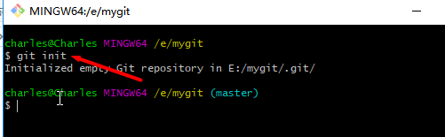

>   Git init

为了避免遇到各种莫名其妙的问题，请确保目录名（包括父目录）不包含中文。

### 5.4.3 把文件添加到版本库

我们可以把TXT文件，网页，所有的程序代码放入版本库

-   创建一个hello.txt

第一步，用命令git add告诉Git，把文件添加到暂存区：

\$ git add readme.txt

第二步，用命令git commit告诉Git，把文件提交到仓库

\$ git commit -m "初始化"

\-m后面输入的是本次提交的说明.最好写的内容和本次提交有关系

### 5.4.4 小结

初始化一个Git仓库，使用git init命令。

添加文件到Git仓库，分两步：

使用命令git add \<file\>，注意，可反复多次使用，添加多个文件；

使用命令git commit -m \<message\>，完成。

 5.5 Git 命令及使用
---------------

###  5.5.1 Git status 

查看仓库当前的状态. 如,我们改变hello.txt .文本内容/然后执行

git status

表示文件被修改,但还没有add

###  5.5.2 Git diff

查看差异.即修改后未添加和已添加的区别

###  5.5.3 Git add 

添加到暂存区

Git add hello.txt

###  5.5.4 Git commit 

提交到本地仓库

Git commit -m “第二次提交”

###  5.5.5 Git log 

查看历史的提交日志

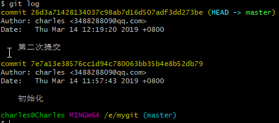

我们一共提交了两次

可以借助参数 --pretty =oneline 看着更舒服

git log --pretty=oneline

###  5.5.6 git reset

恢复到指定的版本.
Git必须知道当前版本是哪个版本，在Git中，用HEAD表示当前版本，上一个版本就是HEAD^，上上一个版本就是HEAD^^，当然往上100个版本写100个\^比较容易数不过来，所以写成HEAD\~100

git reset --hard head ^

恢复到指定的版本号:

git reset --hard 7e7a

7e7a是版本号的前几位.不用写完整。

###  5.5.7 Git reflog

用来查看你每次的操作历史记录.这样即使误操作,也可以恢复你想要的版本了。

###  5.5.8 GIT MV 

用于移动或重命名一个文件、目录、软连接

###  5.5.9 GIT RM

Git中移除某个文件

###  5.5.10 GIT show 

显示提交内容

### 5.5.11 撤销修改\\删除

什么是修改？比如你新增了一行，这就是一个修改，删除了一行，也是一个修改，更改了某些字符，也是一个修改，删了一些又加了一些，也是一个修改，甚至创建一个新文件，也算一个修改。

注意:只有修改并添加到缓存区才能提交到版本库

-   撤销修改

-   场景1：

当你改乱了工作区某个文件的内容，想直接丢弃工作区的修改时，用命令git checkout
file。

-   场景2：

当你不但改乱了工作区某个文件的内容，还添加到了暂存区时，想丢弃修改，分两步，第一步用命令git
reset HEAD \<file\>，就回到了场景1，第二步按场景1操作。

-   场景3：

已经提交了不合适的修改到版本库时，想要撤销本次提交，参考[版本回退](https://www.liaoxuefeng.com/wiki/0013739516305929606dd18361248578c67b8067c8c017b000/0013744142037508cf42e51debf49668810645e02887691000)一节

git checkout hello.txt

-   删除

删除也是一个修改操作, 例如新建一个test.txt文件.并添加到暂时区

git add test.txt

如果把该文件删除，使用 git status 查看

我们两个选项:

1.  彻底从暂存区或版本库删除.

Git rm test.txt

Git commit

1.  从缓存区或版本库中获取

Git checkout test.txt

5.6 工作区和暂存区
--------------

###  5.6.1 工作区

就是你在电脑里能看到的目录，比如我的mygit文件夹就是一个工作区：

### 5.6.2 版本库（Repository）

工作区有一个隐藏目录.git，这个不算工作区，而是Git的版本库。

Git的版本库里存了很多东西，其中最重要的就是称为stage（或者叫index）的暂存区，还有Git为我们自动创建的第一个分支master，以及指向master的一个指针叫HEAD。

前面讲了我们把文件往Git版本库里添加的时候，是分两步执行的：

第一步是用git add把文件添加进去，实际上就是把文件修改添加到暂存区；

第二步是用git commit提交更改，实际上就是把暂存区的所有内容提交到当前分支。

因为我们创建Git版本库时，Git自动为我们创建了唯一一个master分支，所以，现在，git
commit就是往master分支上提交更改。

你可以简单理解为，需要提交的文件修改通通放到暂存区，然后，一次性提交暂存区的所有修改。

5.7 远程仓库
--------

本地创建了一个Git仓库后，我们可以在GitHub创建一个Git仓库，并且让这两个仓库进行远程同步，这样，GitHub上的仓库既可以作为备份，又可以让其他人通过该仓库来协作

###  5.7.1 注册账号

如果githup已经有账号则跳过该步骤

输入网址: <https://github.com/>

国内github脱管平台:https://gitee.com/

注入相应的用户和邮箱地址,
注册成功会给你发送一个确认地址.打开注册邮箱并点击该链接.

### 5.7.2 登录

登录

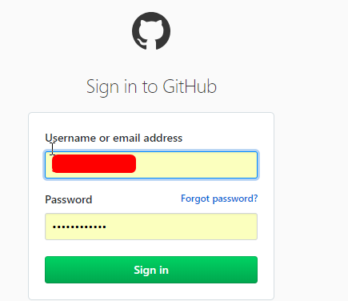

### 5.7.3 建立仓库

-   登录后,页面右上角

-   输入项目信息

-   仓库创建成功

成功后,github会生成一个项目的地址:

目前，在GitHub上的这个studygit仓库还是空的，GitHub告诉我们，可以从这个仓库克隆出新的仓库，也可以把一个已有的本地仓库与之关联，然后，把本地仓库的内容推送到GitHub仓库。

5.8 本地和远程建立连接
------------------

本地通过SSH 或 https两种协议可以与远程通信

SSH :是一种安全认证协议,SSH 会生成两个KEY
,一个私有key,一个是公有的key,建立连接时拿着私有的key和Git
服务器上的配置好的公有的key进行匹配. SSH
公钥进行认证,可以理解为和服务器的连接的”接头暗号” 。

### 5.8.1 SSH协议

-   SSH key.生成命令

在推送之前.需要生成SSH key 用来和远程仓库连接.

ssh-keygen -t rsa -C 你的邮箱地址

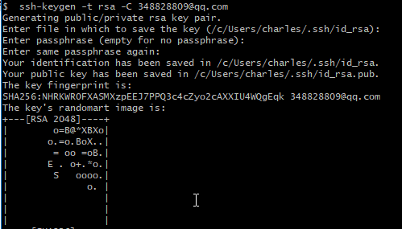

2)一直回车.生成如下

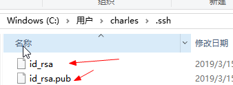

-   在github 网站的右上角,setting,

如下操作

打开本机的sshkey 的id_rsa.pub ,把内容放入以上图片中.点击添加

-   建立连接

在github上找到对应的地址

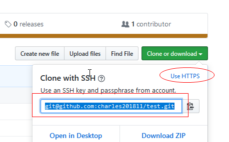

git remote add origin git\@github.com:charles201811/test.git

黄色部分,需要改成你自己对应的项目的地址

###  5.8.2 https协议

适合初学者.

-   建立连接

git remote add origin https://github.com/charles201811/test.git

如果想删除建立好的连接使用命令

git remote rm origin

查看已建立的连接

git remote -v

###  5.8.3 本地和远程库建立连接

当你第一次使用Git的clone或者push命令连接GitHub时，会得到一个警告：

第一次发布:

这是因为Git使用SSH连接，而SSH连接在第一次验证GitHub服务器的Key时，需要你确认GitHub的Key的指纹信息是否真的来自GitHub的服务器，输入yes回车即可。

Git会输出一个警告，告诉你已经把GitHub的Key添加到本机的一个信任列表里了：

Warning: Permanently added 'github.com' (RSA) to the **list** of known hosts.

这个警告只会出现一次，后面的操作就不会有任何警告了。

### 5.8.4 第一次本地库内容发送到远程库

git push -u origin master

如果传送成功 ,如下图片提示:

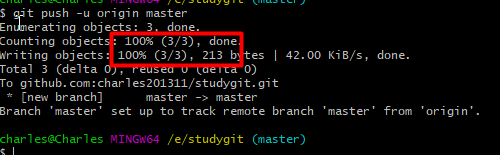

小结:

把本地库的内容推送到远程，用git
push命令，实际上是把当前分支master推送到远程。由于远程库是空的，我们第一次推送master分支时，加上了-u参数，Git不但会把本地的master分支内容推送的远程新的master分支，还会把本地的master分支和远程的master分支关联起来，在以后的推送或者拉取时就可以简化命令。

### 5.8.5 非第一次修改内容发送到远程仓库

git push origin master

。

### 5.8.6 从远程库更新到本地库

git pull origin master

如果远程库有更新.则可以使用以上命令

。

### 5.8.7 第一次从远程仓库克隆到本机

创建一个本机仓库目录,执行命令:

git clone  https://github.com/charles201311/bobo-moive.git

注意:要克隆一个仓库，首先必须知道仓库的地址，然后使用git clone命令克隆

。

### 5.8.8 GIT的忽略提交

git中若不想把一些文件提交到版本库，可以在工作区的根目录下创建.gitignore文件忽略指定的文件。

-   创建.gitignore文件

touch .gitignore

创建完之后则要对.gitignore文件编辑，设置要忽略的文件。

可以直接打开.gitignore文件(比如用EditPlus)进行编辑

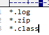

-   在工作区创建相关文件

如图所示：

使用命令: git status

可以在后面添加正斜杠 / 来忽略文件夹，例如 build/ 即忽略build文件夹。

可以使用 ! 来否定忽略，即比如在前面用了 \*.apk ，然后使用 !a.apk
，则这个a.apk不会被忽略。

\* 用来匹配零个或多个字符，如 \*.[oa] 忽略所有以".o"或".a"结尾， \*\~ 忽略所有以
\~ 结尾的文件（这种文件通常被许多编辑器标记为临时文件）； []
用来匹配括号内的任一字符，如 [abc] ，也可以在括号内加连接符，如 [0-9]
匹配0至9的数； ? 用来匹配单个字符。

看了这么多，还是应该来个栗子：

\# 忽略 .a 文件

\*.a

\# 但否定忽略 lib.a, 尽管已经在前面忽略了 .a 文件

!lib.a

\# 仅在当前目录下忽略 TODO 文件， 但不包括子目录下的 subdir/TODO

/TODO

\# 忽略 build/ 文件夹下的所有文件

build/

\# 忽略 doc/notes.txt, 不包括 doc/server/arch.txt

doc/\*.txt

\# 忽略所有的 .pdf 文件 在 doc/ directory 下的

doc/\*\*/\*.pdf

。

# 5.9  Eclipse中使用git

Eclipse 一般都会默认集成了git.如果eclipse版本低.则可以在

###  5.9.1 配置用户和邮箱

每次提交都将包含用户名和邮件，可以通过“Window =\> Preferences  =\>  Team =\> Git
=\> Configuration”配置，通过Add Entry 按钮添加信息，

     key ： user.name，value：用户名 ；key：user.email ， value ：
邮箱，账户信息通常GitHub相同。

###  5.9.2 创建项目

创建一个web项目并右键项目--team-shareProjet

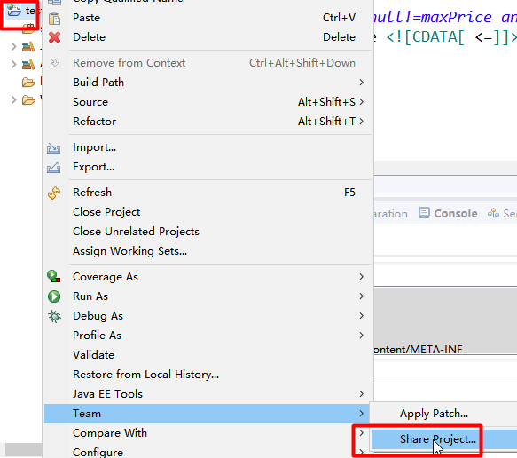

创建本地仓库

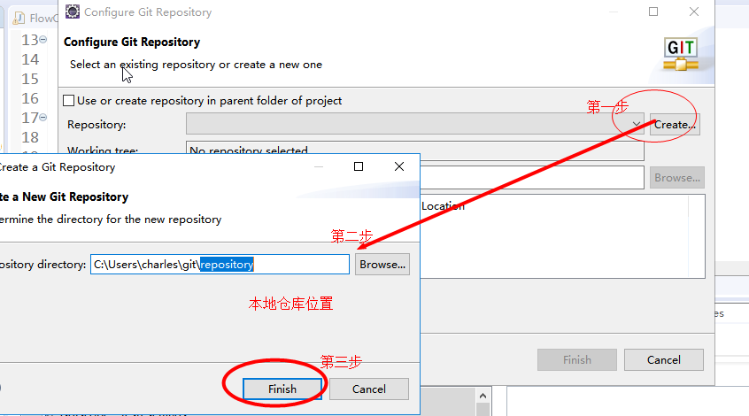

### 5.9.3 把项目添加到暂存区

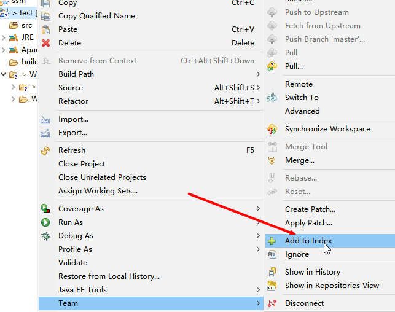

### 5.9.4 把项目提交到本地仓库

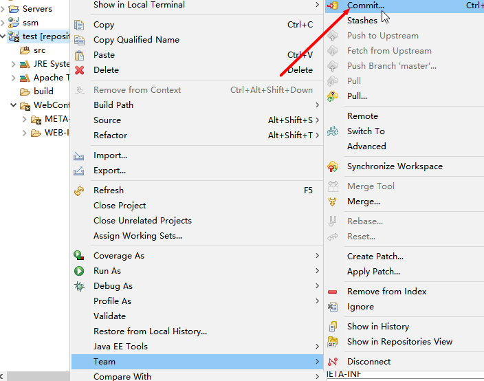

### 5.9.5 把本地项目推送到远程分支

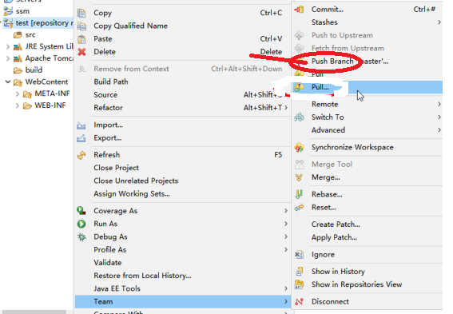

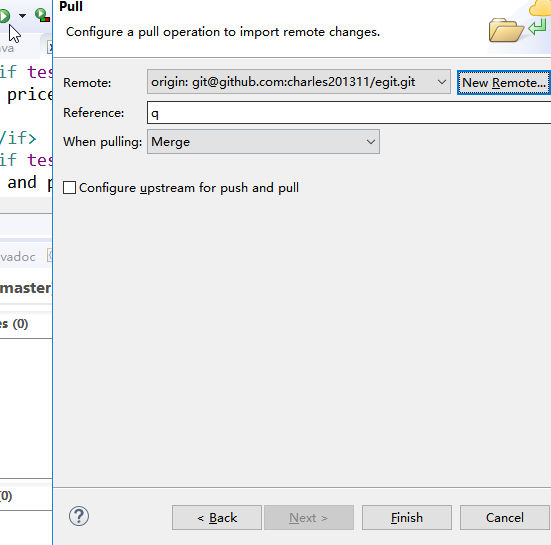

###  5.9.6  解决冲突

-   制造冲突

-   改变本地文件

-   添加到暂存区,提交到本地本地仓库

-   改变远程分支文件

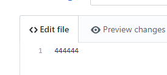

-   从远程分支pull

-   查看冲突

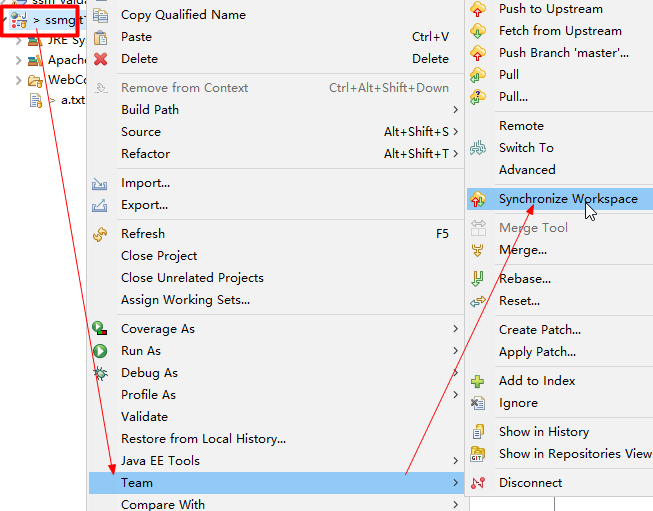

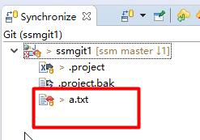

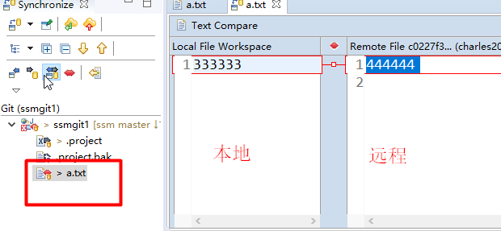

-   解决冲突

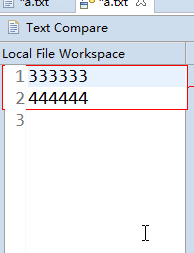

1.  根据业务情况合并冲突

>   合并冲突后,会产生新的版本在本地.需要再次执行 add to index ---commit--\>pull

>   添加到暂存区

1.  提交到本地分支

1.  推送到远程

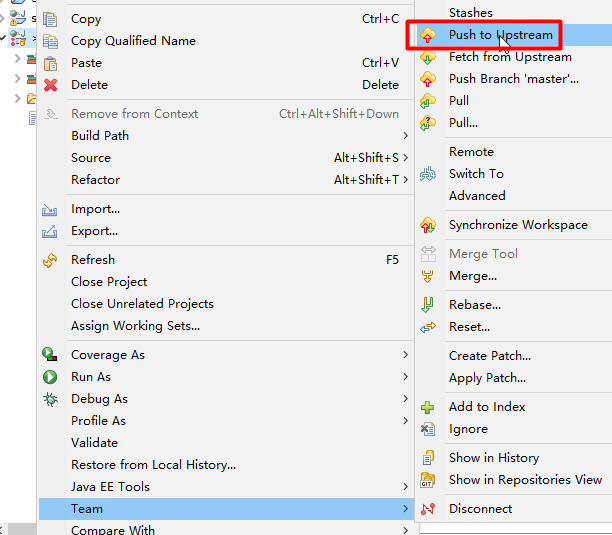

###     5.9.7 eclipse中git提交忽略不必要文件

1.  打开Navigator窗口，找到.gitignore文件（如果没有就添加一个）

　　Navigator窗口: window -\>  show view -\>  other-\> Navigator

1.  配置需要忽略的文件。

| /target/ /.settings/ .classpath .project .gitignore |
|-----------------------------------------------------|

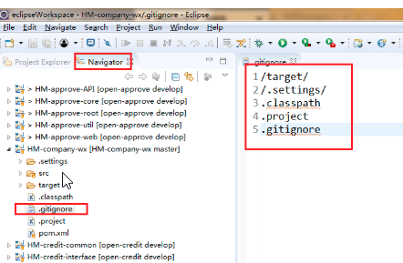

5.10 Github 团队合作
---------------

### 5.10.1 进入github网站,找到项目分支

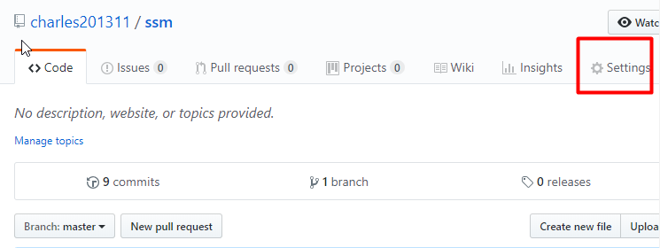

###  5.10.2 输入要协作的对方的github 账户或邮箱

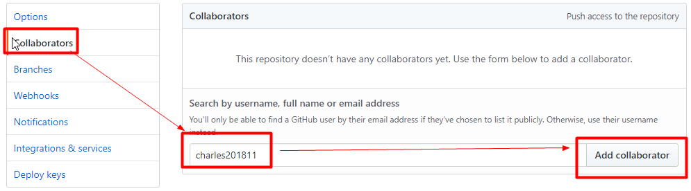

把地址发送给协作者

协作者接到该地址后,在浏览器里输入该地址

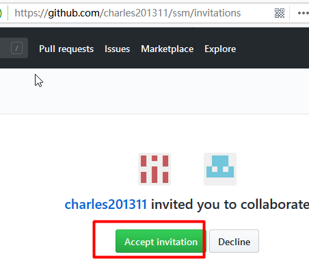

这时，在对方的本地添加远程仓库：

git add remote origin https://githubs.com/charles201311/ssm/invitations 

这样对方就可以pull和push了。
在进行的合作开发的过程中注意最好不要直接在master分支下，而是在其他的分支下进行开发操作,最后发布的时候合并到master分支中。