**密 级： 普通**

**大数据专高CMS设计说明书**

**\<版本: 1.0 \>**

文档修订记录

| 版本 | \*变化状态 | 修订说明 | 日期       | 变更人 |
|------|------------|----------|------------|--------|
| V1.0 | A          | 文档初建 | 2019-10-21 | 朱志广 |
|      |            |          |            |        |
|      |            |          |            |        |
|      |            |          |            |        |
|      |            |          |            |        |
|      |            |          |            |        |
|      |            |          |            |        |

\*变化状态：A——增加，M——修改，D——删除

**目录**

[1 引言 3](#引言)

[1.1 目的 3](#目的)

[1.2 范围 3](#范围)

[1.3 定义 4](#定义)

[1.4 参考资料 4](#参考资料)

[2 系统架构设计 4](#系统架构设计)

[2.1 项目层次的划分 4](#项目层次的划分)

[2.2 安全管理 5](#安全管理)

[2.3 重用性 5](#重用性)

[2.4 维护性 6](#维护性)

[2.5 开发技术选型 6](#开发技术选型)

[3 项目文件结构 6](#项目文件结构)

[4 部署方案设计 8](#部署方案设计)

[5 开发框架 8](#开发框架)

[6 系统安全设计 8](#系统安全设计)

[6.1 用户安全设计 8](#用户安全设计)

[7 数据建模 9](#数据建模)

[7.1 概述 9](#概述)

[7.2 表结构数据字典说明 10](#表结构数据字典说明)

[7.2.1 用户表 10](#用户表)

[7.2.2 频道表 10](#频道表)

[7.2.3 分类表 10](#分类表)

[7.2.4 文章表 10](#文章表)

[7.2.5 标签表 11](#标签表)

[7.2.6 文章标签关联表 11](#文章标签关联表)

[7.2.7 文章评论表 11](#文章评论表)

[7.2.8 投票内容表 11](#投票内容表)

[7.2.9 投票表 12](#投票表)

[7.2.10 轮播图表（幻灯片） 12](#轮播图表幻灯片)

[7.2.11 系统设置表 12](#系统设置表)

[7.3 E-R图 12](#e-r图)

[8 数据校验 14](#数据校验)

[8.1 前端数据校验 14](#前端数据校验)

[8.1.1 概述 14](#概述-1)

[8.1.2 使用办法 14](#使用办法)

[8.2 后端数据校验 16](#后端数据校验)

[8.2.1 引入依赖 16](#引入依赖)

[8.2.2 使用校验规则 16](#使用校验规则)

[8.2.3 控制层的处理 16](#控制层的处理)

[8.2.4 异步提交后台处理 18](#异步提交后台处理)

[9 协议 19](#协议)

[10 安全控制 19](#安全控制)

[10.1 权限拦截 19](#权限拦截)

[10.1.1 编写拦截器 19](#编写拦截器)

[11 后台管理系统设计 20](#后台管理系统设计)

[11.1 登录 20](#登录)

[11.1.1 前端 20](#前端)

[11.1.2 后端 21](#后端)

[11.2 管理中心 23](#管理中心)

[11.2.1 前端 23](#前端-1)

[11.2.2 后端 24](#后端-1)

[11.3 文章管理 24](#文章管理)

[11.3.1 前端 25](#前端-2)

[11.3.2 后端 29](#后端-2)

[11.4 用户管理 33](#用户管理)

[11.4.1 前端 34](#前端-3)

[11.4.2 后端 36](#后端-3)

[12 前台系统设计 38](#前台系统设计)

[12.1 用户注册 38](#用户注册)

[12.1.1 前端 39](#前端-4)

[12.1.2 后端 39](#后端-4)

[12.2 登录 42](#登录-1)

[12.3 登出 42](#登出)

[12.4 首页 42](#首页)

[12.4.1 前端 43](#前端-5)

[12.4.2 后端 45](#后端-5)

[12.5 文章详情 51](#文章详情)

[12.5.1 前端 51](#前端-6)

[12.5.2 后端 53](#后端-6)

[12.5.2.1 控制层 53](#控制层)

[12.5.2.2 服务层 54](#服务层)

[12.5.2.3 数据层 55](#数据层)

[12.6 个人中心 56](#个人中心)

[12.7 发布文章 56](#发布文章)

[12.7.1 要求 56](#要求)

[12.7.2 前端 57](#前端-7)

[12.7.3 后端 59](#后端-7)

[12.8 我的文章 64](#我的文章)

[12.9 文章修改 67](#文章修改)

[12.9.1 前端 67](#前端-9)

[12.9.2 后端 70](#后端-9)

引言
====

目的
----

本文主要根据业务需求特点，来逐渐明确系统的数据结构与软件结构，将软件需求转化为软件表示，是项目小组协同开发的基础，供系统开发人员、测试人员使用。

范围
----

>   需求是内容管理系统（Content Management
>   System）需求的一部分，本文主要描述CMS用户管理、内容管理以及分类管理。本文的编写依据为《CMS需求规格说明书》。

定义
----

CMS：内容管理系统（Content Management System）

参考资料
--------

>   《CMS需求规格说明书》

系统架构设计
============

>   本项目根据业务需要，将架构按照如图所示架构，将数据存储、业务逻辑、数据展示、逻辑控制进行分离，同时项目引入日志管理系统以便项目后期维护和追踪，另外项目引入安全管理系统，保障系统数据安全可靠，防止数据的损坏、丢失或者泄露。

项目层次的划分
--------------

项目采用B/S架构，jsp与前后端分离相结合的模式，

-   表示层：

>   采用jsp+html+css+JQuery+bootstrap

-   控制层

>   采用Spring MVC中Controller进行控制页面逻辑关系。

-   业务逻辑层：

>   采用Spring MVC中Service进行业务处理及业务规则控制。

-   数据实体层：

>   采用POJO
>   的Model类及Mybatis进行数据持续化处理，即业务实体与其物理实体的映射。

-   资源层：

>   采用磁盘对图片资源或者其他文件类型数据资源进行管理。

-   后端架构Flow图

1：Controller控制动作

2：前端传递的参数（Json/对象）给控制层，控制层接收数据自动转换成（pojo）对象

3：控制层接受数据后传递业务层（Service层）。

3：Service层对数据进行处理，通过dao层与数据持久层进行数据交互。

4：流程图如下所示：

安全管理
--------

安全管理模块考虑内容主要以下几个层面：

1.防止注入

>   后台采用Mybatis避免SQL注入；

>   前端对可输入数据进行校验；

>   控制层在接受数据后对数据进行校验；

1.  非法篡改

>   用户分角色和权限

>   利用过滤器进行访问权限的控制。

重用性
------

将常用的类、方法封装成工具类，形成自己的工具包。

维护性
------

1：使用日志。

开发技术选型
------------

开发语言：Java/JavaScript等

开发工具：Eclipse J2ee Oxygen

构建工具：maven3.6.1

版本管理：git

框架选型：

>   Spring：5.1.5.RELEASE

>   mybatis：3.4.2

>   log41.2.17

>   Druid：1.0.9

>   Mysql:5.1.6

>   Mybatis_spring1.3.0

>   jackson2.9.1

>   hibernate-validator:6.0.10.Final

>   Jstl：1.2

>   servlet-api：2.5

>   jsp-api：2.0

>   commons-fileupload：1.3.1

>   Junit：4.12

>   aspectj-version：1.8.0

>   pagehelper-version：5.1.2

运行环境：

>   Jetty

>   Mysql

>   Linux/windows

 项目文件结构
=============

如下是工程的目录结构，其中目录中出现的mmcro是开发者的名字，要求开发人员根据自己的实际情况对其进行替换。

├─.settings // eclipse的工程的配置目录

├─src // 项目的所有的源码

│ ├─main //主目录，不包含单元测试代码

│ │ ├─java//Java源代码

│ │ │ └─com

│ │ │ └─mmcro

│ │ │ └─cms

│ │ │ ├─controller //控制层

│ │ │ ├─dao //dao层

│ │ │ ├─entity //实体bean

│ │ │ ├─service //service接口以及实现的目录

│ │ │ │ └─impl // service的实现

│ │ │ ├─utils // 本项目中的工具类

│ │ │ └─web //存放于web相关的内容，如拦截器、过滤器等

│ │ ├─resources //资源文件

>   │ db.properties // 数据库配置

>   │ log4j.properties // 日志配置

>   │ mybatis.xml // mybatis配置

>   │ spring-beans.xml // springbean

>   │ spring-mvc.xml //springmvc配置

│ │ └─webapp // web内容目录

│ │ ├─resource // 引入资源目录

│ │ │ ├─css //样式

│ │ │ │ └─jquery

│ │ │ ├─images // 图片资源

│ │ │ ├─js //js资源

│ │ │ ├─kindeditor //富文本编辑器

│ │ │ └─pic //图片资源

│ │ └─WEB-INF //

│ │ └─view // jsp 视图

│ │ ├─admin // 管理员内容

│ │ │ ├─article // 文章管理部分

│ │ │ └─user //用户管理部分

│ │ ├─common //通用的部分

│ │ ├─index //客户访问的视图

│ │ │ ├─article //文章

│ │ │ └─comment// 评论

│ │ ├─my // 个人中心

│ │ │ ├─article//个人文章管理

│ │ │ ├─comment//个人评论

│ │ │ └─vote //个人投票

│ │ ├─passport // 修改密码

│ │ └─user // 注册登录等

│ └─test // 测试的目录

│ ├─java //测试的源码目录

│ │ └─com

│ │ └─mmcro

│ │ └─cms

│ └─resources //测试的配置文件

└─target // maven构建编译的中间文件

部署方案设计
============

内容管理系统的部署需要，Web服务和Oracle服务器各一台。

Web服务器安装：apache、tomcat，配置域名并解析。

系统本身对配置要求不高，要考虑整个相关系统数据同步性能和数据库的压力。

开发框架
========

系统采用Java语言作为系统的主要开发语言，主要用J2EE定义的技术组件来搭建系统框架。展示层采用Jsp，控制层采用spring-mvc
，持久层采用Ibatis。

系统安全设计
============

用户安全设计
------------

1.  邮箱账户设计，按用户姓名拼音规则设置用户账户，如：张三，zhangsan；张三丰，zhangsf,
    用户账户在系统是唯一的，如果按照用户姓名系统出现相同的用户账户，可加“_”或数据处理，以做区分。

2.  用户账户的生命周期管理，用户账户根据业务部门需要新增、删除和停用，可授权某人新增账户或业务部门通知系统管理员给开设账户，开设账户必须有纸质文件或电子邮件或OA才能开通，具体开通流程待定；根据业务需要用户账户，能做删除、停用等处理。

3、用户账户的密码设计，用户的密码不能少于6位；账户做MD5加密处理。

数据建模
========

概述
----

本项目数据建模严格按照数据库第二范式，以保证数据的完整和准确性。项目中投票为可选功能，在时间允许的情况下可以完成，其他是必须完成功能。根据《CMS需求规格说明书》设计表结构，说明如下表格：

| 编号 | 表名称                 | 说明                                                                         |
|------|------------------------|------------------------------------------------------------------------------|
|      | cms_article            | 文章表                                                                       |
|      | cms_article_tag_middle | 文件与标签的中间表                                                           |
|      | cms_article_vote       | 投票内容表，某个用户或者管理员就某个事情发起投票，则投票内容保存在这个表中。 |
|      | cms_category           | 文章分类表                                                                   |
|      | cms_comment            | 评论表，数据为用户针对文章发表的评论                                         |
|      | cms_channel            | 频道表                                                                       |
|      | cms_settings           | 系统设置表，暂时未启用                                                       |
|      | cms_slide              | 幻灯片表                                                                     |
|      | cms_tag                | 标签表                                                                       |
|      | cms_user               | 用户表，管理员与注册用户均存放在这个表中                                     |
|      | cms_vote               | 投票表，暨用户针对那个投票内容进行的投票。                                   |

表结构数据字典说明
------------------

### 用户表

| 列名        | 类型     | 长度 | 小数点位数 | 是否允许为空 | 是否为主键 | 说明                |
|-------------|----------|------|------------|--------------|------------|---------------------|
| id          | int      | 11   | 0          | 否           | 是         |                     |
| username    | varchar  | 20   | 0          | 是           | 否         | 用户名称            |
| password    | varchar  | 50   | 0          | 是           | 否         | 密码，加盐加密      |
| nickname    | varchar  | 20   | 0          | 是           | 否         | 昵称                |
| birthday    | date     | 0    | 0          | 是           | 否         | 生日                |
| gender      | int      | 11   | 0          | 是           | 否         | 性别                |
| locked      | int      | 11   | 0          | 是           | 否         | 1:正常,0:禁用       |
| create_time | datetime | 0    | 0          | 是           | 否         | 注册时间            |
| update_time | datetime | 0    | 0          | 是           | 否         | 最后修改时间        |
| url         | varchar  | 200  | 0          | 是           | 否         | 外链个人主页        |
| score       | int      | 11   | 0          | 是           | 否         | 积分                |
| role        | varchar  | 1    | 0          | 是           | 否         | 0:普通用户,1:管理员 |

### 频道表

| 列名        | 类型    | 长度 | 小数点位数 | 是否允许为空 | 是否为主键 | 说明     |
|-------------|---------|------|------------|--------------|------------|----------|
| id          | int     | 11   | 0          | 否           | 是         |          |
| name        | varchar | 30   | 0          | 是           | 否         | 频道名称 |
| description | varchar | 50   | 0          | 是           | 否         | 描述     |
| icon        | varchar | 50   | 0          | 是           | 否         | 图标     |

### 分类表

| 列名       | 类型    | 长度 | 小数点位数 | 是否允许为空 | 是否为主键 | 说明         |
|------------|---------|------|------------|--------------|------------|--------------|
| id         | int     | 11   | 0          | 否           | 是         |              |
| name       | varchar | 20   | 0          | 是           | 否         | 名称         |
| channel_id | int     | 11   | 0          | 是           | 否         | 外键，频道id |

### 文章表

| 列名        | 类型     | 长度 | 小数点位数 | 是否允许为空 | 是否为主键 | 说明                             |
|-------------|----------|------|------------|--------------|------------|----------------------------------|
| id          | int      | 11   | 0          | 否           | 是         |                                  |
| title       | varchar  | 50   | 0          | 是           | 否         | 标题                             |
| content     | text     | 0    | 0          | 是           | 否         | 内容                             |
| picture     | varchar  | 200  | 0          | 是           | 否         | 标题图片                         |
| channel_id  | int      | 11   | 0          | 是           | 否         | 外键，频道表主键id               |
| category_id | int      | 11   | 0          | 是           | 否         | 外键，分类表主键Id               |
| user_id     | int      | 11   | 0          | 是           | 否         | 外键，用户表的主键id             |
| hits        | int      | 11   | 0          | 是           | 否         | 点击次数                         |
| hot         | int      | 11   | 0          | 是           | 否         | 是否热门                         |
| status      | int      | 11   | 0          | 是           | 否         | 0,刚发布,1审核通过,-1 审核未通过 |
| deleted     | int      | 11   | 0          | 是           | 否         | 1 表示删除，逻辑删除             |
| created     | datetime | 0    |            | 是           | 否         | 发布时间                         |
| updated     | datetime | 0    |            | 是           | 否         | 最后更新时间                     |
| commentCnt  | Int      | 11   |            | 是           | 否         | 评论数量                         |
|             |          |      |            |              |            |                                  |

### 标签表

| 列名    | 类型    | 长度 | 小数点位数 | 是否允许为空 | 是否为主键 | 说明 |
|---------|---------|------|------------|--------------|------------|------|
| id      | int     | 11   | 0          | 否           | 是         |      |
| tagname | varchar | 255  | 0          | 是           | 否         | 标签 |

### 文章标签关联表

| 列名 | 类型 | 长度 | 小数点位数 | 是否允许为空 | 是否为主键 | 说明   |
|------|------|------|------------|--------------|------------|--------|
| aid  | int  | 11   | 0          | 否           | 是         | 文章id |
| tid  | int  | 11   | 0          | 否           | 是         | 标签id |

### 文章评论表

| 列名      | 类型     | 长度 | 小数点位数 | 是否允许为空 | 是否为主键 | 说明     |
|-----------|----------|------|------------|--------------|------------|----------|
| id        | int      | 11   | 0          | 否           | 是         |          |
| articleId | int      | 11   | 0          | 是           | 否         | 文章ID   |
| userId    | int      | 11   | 0          | 是           | 否         | 用户id   |
| content   | varchar  | 256  | 0          | 是           | 否         | 评论内容 |
| created   | datetime | 0    | 0          | 是           | 否         | 发布时间 |

### 投票内容表

| 列名    | 类型    | 长度 | 小数点位数 | 是否允许为空 | 是否为主键 | 说明 |
|---------|---------|------|------------|--------------|------------|------|
| id      | int     | 11   | 0          | 否           | 是         |      |
| content | varchar | 256  | 0          | 是           | 否         |      |
| title   | varchar | 128  | 0          | 是           | 否         |      |

### 投票表

| 列名       | 类型 | 长度 | 小数点位数 | 是否允许为空 | 是否为主键 | 说明 |
|------------|------|------|------------|--------------|------------|------|
| id         | int  | 11   | 0          | 否           | 是         |      |
| article_id | int  | 11   | 0          | 是           | 否         |      |
| user_id    | int  | 11   | 0          | 是           | 否         |      |
| option     | char | 255  | 0          | 是           | 否         |      |

### 轮播图表（幻灯片）

| 列名    | 类型    | 长度 | 小数点位数 | 是否允许为空 | 是否为主键 | 说明 |
|---------|---------|------|------------|--------------|------------|------|
| id      | int     | 11   | 0          | 否           | 是         |      |
| title   | varchar | 50   | 0          | 是           | 否         |      |
| picture | varchar | 50   | 0          | 是           | 否         |      |
| url     | varchar | 50   | 0          | 是           | 否         |      |

### 系统设置表

| 列名              | 类型    | 长度 | 小数点位数 | 是否允许为空 | 是否为主键 | 说明 |
|-------------------|---------|------|------------|--------------|------------|------|
| id                | int     | 11   | 0          | 否           | 是         |      |
| site_domain       | varchar | 50   | 0          | 是           | 否         |      |
| site_name         | varchar | 50   | 0          | 是           | 否         |      |
| article_list_size | int     | 11   | 0          | 是           | 否         |      |
| slide_size        | int     | 11   | 0          | 是           | 否         |      |
| admin_username    | varchar | 16   | 0          | 是           | 否         |      |
| admin_password    | varchar | 32   | 0          | 是           | 否         |      |

 E-R图
------

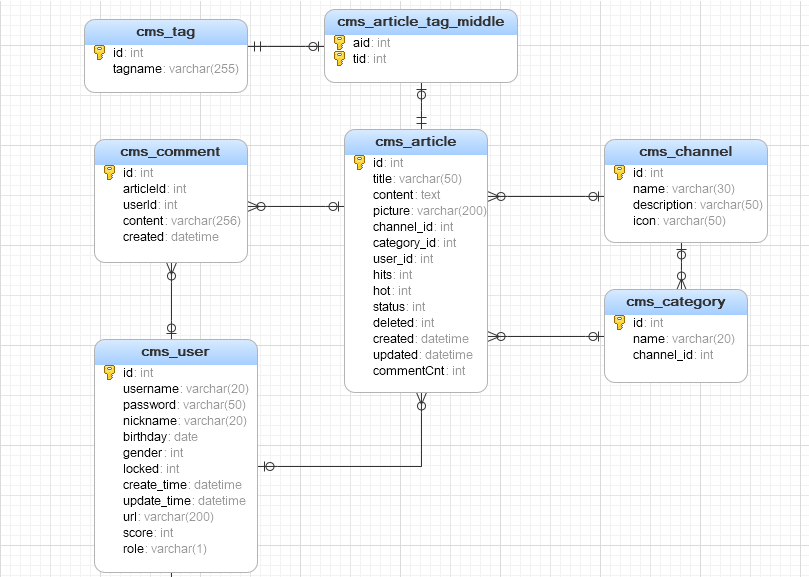

 数据校验
=========

前端数据校验
------------

### 概述

>   使用jQuery validate

### 使用办法

1、jQuery validate的使用

引入包

| \<script type="text/javascript" src="/script/jquery.min.js"\>\</script\> \<script type="text/javascript" src="/script/jquery.validate.min.js"\>\</script\> \<script src="/dist/localization/messages_zh.js"\>\</script\> |
|--------------------------------------------------------------------------------------------------------------------------------------------------------------------------------------------------------------------------|

2、页面或CSS样式中增加高亮显示错误

| .error{ color:red; } |
|----------------------|

4、需要校验的页面增加

| \<script\> \$().ready(function() { \$("\#form").validate(); }); \</script\> |
|-----------------------------------------------------------------------------|

>   5、在每个录入栏目目中增加规则

| \<li\> \用户名:\</span\> |
|---------------------------------------------|

>   \<input type="text" name="userName" id="userName" minlength="4"
>   maxlength="24" remote="/user/checkName" required\>

\</li\>

>   6、校验

>   A） 直接提交 在提交的时候会自动校验该表单中的内容是否合法，如果不合法
>   则以高亮的形式显示错误

| \$("\#form").submit(); |
|------------------------|

>   B）ajax
>   提交，这种提交方式需要先手动调用validate方法，如果通过则调用ajax提交，否则停留在当前的页面

| // 手动验证 然后提交 function commitShoudong(){ if(!\$("\#form").valid()){ return; } \$("\#form").submit(); } |
|---------------------------------------------------------------------------------------------------------------|

1.  支持的校验规则

| required:true 必输字段 |
|------------------------|

2.  remote:"check.jsp" 使用ajax方法调用check.jsp验证输入值

3.  email:true 必须输入正确格式的电子邮件

4.  url:true 必须输入正确格式的网址

5.  date:true 必须输入正确格式的日期 日期校验ie6出错，慎用

6.  dateISO:true 必须输入正确格式的日期(ISO)，例如：2009-06-23，1998/01/22
    只验证格式，不验证有效性

7.  number:true 必须输入合法的数字(负数，小数)

8.  digits:true 必须输入整数

9.  creditcard: 必须输入合法的信用卡号

10. equalTo:"\#field" 输入值必须和\#field相同

11. accept: 输入拥有合法后缀名的字符串（上传文件的后缀）

12. maxlength:5 输入长度最多是5的字符串(汉字算一个字符)

13. minlength:10 输入长度最小是10的字符串(汉字算一个字符)

14. rangelength:[5,10] 输入长度必须介于 5 和 10 之间的字符串")(汉字算一个字符)

15. range:[5,10] 输入值必须介于 5 和 10 之间

16. max:5 输入值不能大于5

17. min:10 输入值不能小于10

后端数据校验
------------

### 引入依赖

| \<dependency\> |
|----------------|

>   \<groupId\>org.hibernate\</groupId\>

>   \<artifactId\>hibernate-validator\</artifactId\>

>   \<version\>5.2.4.Final\</version\>

>   \</dependency\>

### 使用校验规则 

在实体Bean上使用注解方式增加校验规则

| public class User implements Serializable { \@Length(max=10,min=5,message="哎呀，长度不合适啊") private String name; } |
|------------------------------------------------------------------------------------------------------------------------|

###  控制层的处理

修改提交的controller 当中的响应函数 重要的点：\@Validated

| \@RequestMapping(value="register",method=RequestMethod.POST) public String register(HttpServletRequest rquest,\@Validated \@ModelAttribute("user") User user, BindingResult result) { } |
|-----------------------------------------------------------------------------------------------------------------------------------------------------------------------------------------|

Jsp视图层的处理

视图jsp引入form 标签：

| \<%\@ taglib prefix="form" uri="http://www.springframework.org/tags/form"%\> \<form:form id="form" modelAttribute="user" action="register" method="post"\> \<!-- 这里是输入内容 --\> \<form:input type="password" path="passwd" name="passwd" id="passwd"/\> \<!-- 这里是如果有错误 则返回的错误 --\> \<form:errors path="passwd" cssClass="errorMsg"\>\</form:errors\> \</form:form\> |
|----------------------------------------------------------------------------------------------------------------------------------------------------------------------------------------------------------------------------------------------------------------------------------------------------------------------------------------------------------------------------------------|

>   使用form 标签 modelAttribute 中的属性值 必须与 3
>   中的ModelAttribute参数值一模一样

如果jsp 是由跳转过来的 则 modelAttribute
的属性必须要有值。可以在条状到这个页面之前赋值即可。

比如：

\@RequestMapping(value="register",method=RequestMethod.GET)

public String register(HttpServletRequest rquest,HttpSession session) {

rquest.setAttribute("user",new User());

return "register1";

}

4、jsp 的修改

\<form:form id="form" modelAttribute="user" action="register" method="post"\>

\<!-- 这里是输入内容 --\>

\<form:input type="password" path="passwd" name="passwd" id="passwd"/\>

\</form:form\>

//ajax 提交并返回错误的结果 验证的方式

function commitajax(){

\$.ajax({

url:"registerajax",

type:"post",

data:\$("\#form").serialize(),

success:function(data){ // 返回的错误信息的列表

if(data.length\<=0){

alert('提交成功')

}else{

// 对返回的错误进行解析

for ( var i in data) {

// 拼接字符串 包含了表单输入框的名称 以及 错误信息

var strJson = '{"'+data[i].field + '":"' + data[i].defaultMessage + '"}'

// 转换成对象

alert(strJson)

var obj = \$.parseJSON( strJson);

// 将错误显示在输入框的后边

validate.showErrors(obj)

}

}

}

})

}

### 异步提交后台处理

>   controller 的提交地址

\@RequestMapping(value="registerajax",method=RequestMethod.POST)

\@ResponseBody

public List\<ObjectError\> registerajax(HttpServletRequest rquest,

\@Validated \@ModelAttribute("user") User user,

BindingResult result) {

rquest.getSession().getAttribute(P2PContant.CODE);// hard code

if("123456".equals(user.getPasswd())) {

result.rejectValue("passwd", "ming", "密码太简单啦o！");

}

return result.getAllErrors();

}

协议
====

这里主要强调页面接收后台返回的的json数据格式。要求后端返回的数据格式如下：

{

"result": 1,

"errorMsg": "获取数据成功",

"data": ...

}

键result 含义：处理结果 1表示后端处理成功，其他数值表示处理失败，不同数值
代表不同含义，由开发人员自定义。

键errorMsg 含义：当处理结果不正确的时候，错误信息，用于提示用户。

键data 含义：返回给前端的数据。

安全控制
========

权限拦截
--------

### 编写拦截器

编写一个类AuthIntercepter 并实现 HandlerInterceptor。

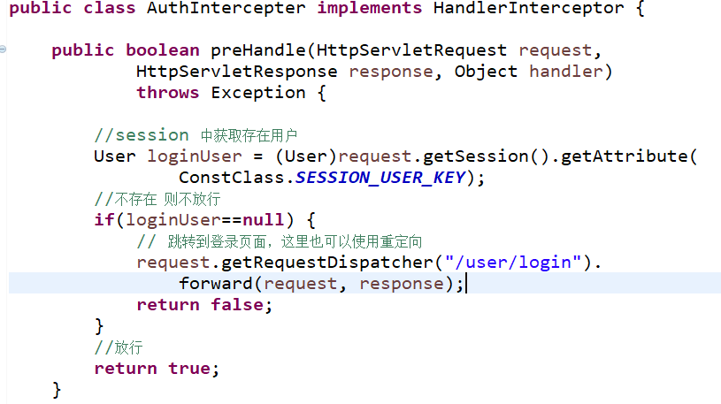

在mvc配置文件中配置拦截器。

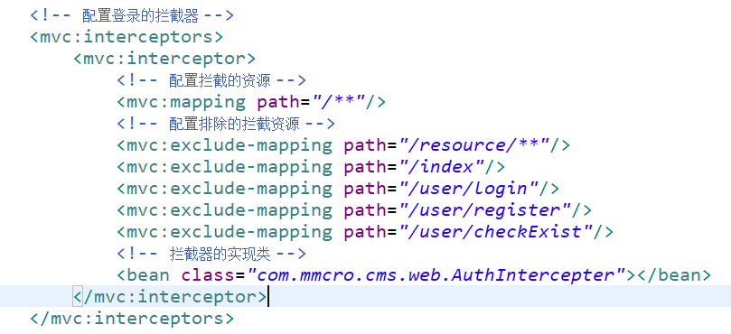

后台管理系统设计
================

 登录
-----

### 前端

实现效果如图：

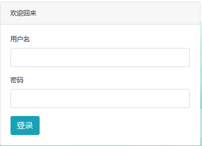

实现说明：

使用bootstrap 实现上述jsp页面。

输入：

用户名、密码、点击登录

输出：

跳转到后台管理页面

校验：

-   用户名不能为空

-   密码不能为空

异常处理：

异常跳转到异常显示页面。

### 后端

-   控制层

-   进入登录页面

>   \@GetMapping("login")

>   **public** String login() {

>   //Todo

>   }

-   登录请求

>   \@PostMapping("login")

>   **public** String login(HttpServletRequest request,User user) {

>   // todo

>   // 调用service相应的方法，

>   //如果登录成功 则保存数据到session当中，并跳转到管理中心

>   }

>   否则继续显示登录页面，并且返回错误信息。代码如下：

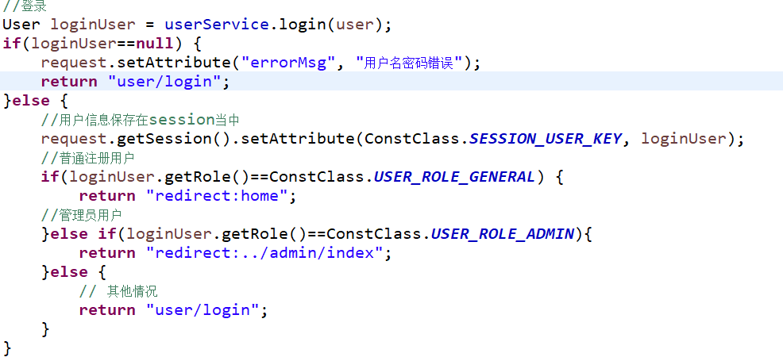

>   }

-   服务层

| **public** User login(User user) { |
|------------------------------------|

>   //根据用户名查找用户，返回的用户对象密码密文与与参数中的用户明文加密后的结果进行对比，如果一样则返回用户对象，意为登录成功，否则认为用户不存在，登录失败。

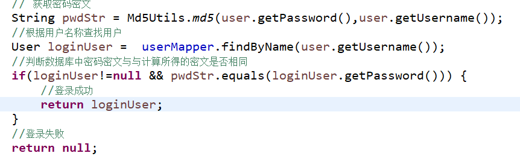

>   }

-   数据层

 管理中心
---------

### 前端

>   实现效果如图所示：

>   页面使用bootstap实现。

>   页面主要分为三部分分别为顶部、左侧功能导航和右侧工作区。

-   顶部

>   需要实现下拉式的导航栏。

>   实现的功能包含返回主页、进入修改密码功能和退出登录等操作。

>   实现的代码如下：

>   \<ul class=*"navbar-nav ml-auto ml-md-0"*\>

>   \<li class=*"nav-item dropdown no-arrow mx-1"*\>

>   \<a class=*"nav-link"* href=*"\#"* id=*"messagesDropdown"* role=*"button"*
>   aria-haspopup=*"true"* aria-expanded=*"false"*\>

>   \<i class=*"fas fa-envelope fa-fw"*\>\</i\>

>   \7\</span\>

>   \</a\>

>   \</li\>

>   \<li class=*"nav-item dropdown no-arrow"*\>

>   \<a class=*"nav-link dropdown-toggle"* href=*"\#"* id=*"userDropdown"*
>   role=*"button"* data-toggle=*"dropdown"* aria-haspopup=*"true"*
>   aria-expanded=*"false"*\>

>   \<i class=*"fas fa-user-circle fa-fw"*\>\</i\>

>   \</a\>

>   \
   aria-labelledby=*"userDropdown"*\>

>   \<a class=*"dropdown-item"* href=*"\#"*\>返回网站\</a\>

>   \<a class=*"dropdown-item"* href=*"\#"*\>修改密码\</a\>

>   \
\</div\>

>   \<a class=*"dropdown-item"* href=*"/user/logout"* \>退出\</a\>

>   \</div\>

>   \</li\>

>   \</ul\>

>   \</nav\>

-   左侧

>   左侧导航使用bootstrap 的实现。代码基本样式为：

>   \<ul class=*"sidebar navbar-nav"* \>

>   \<li class=*"nav-item"*\>\<a class=*"nav-link"* href=*"javascript:void(0)"
>   data*=*"/admin/manArticle"*\>

>   \<i class=*"fas fa-fw fa-folder"*\>\</i\> \<span\>文章管理\</span\>

>   \</a\>\</li\>

>   。。。。。。。。。。。。。

\</ul\>

>   在整个页面加载完成后执行预加载函数，为每个li中的超链接增加点击事件，当点击以后右侧的工作区提供相应的操作。实现的代码如下：

>   \$('.nav-link').click(**function**(){

>   //获取当前默认高亮的属性

>   **var** li = \$('.nav-link.active');

>   //移除目前高亮的样式

>   li.removeClass('active');

>   //为当前点击行添加高亮的样式

>   \$(**this**).addClass('active');

>   //获取点击的的*url*

>   **var** url = \$(**this**).attr('data');

>   //在中间区域显示地址的内容

>   \$('\#content-wrapper').load(url);

>   })

### 后端

>   这里不涉及后端的代码的实现。

文章管理
--------

>   文章管理的内容包含文章的审核、设置热点状态、根据状态查询、分页等。实现效果如下图所示：

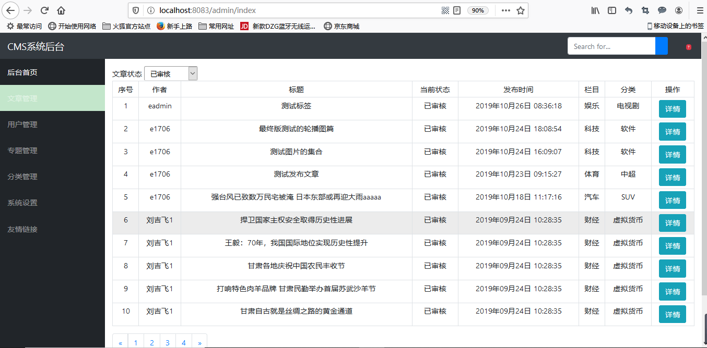

>   点击详情后查看文章内容，可以文章具体内容，并在该页面修改审核状态和热门状态。如下图所示：

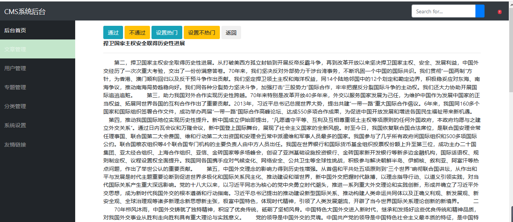

###  前端

-   文章列表

>   文章状态下拉列表直接使用固定的四个状态即可，在根据状态查询后，状态下拉框数据能够正确的回显。默认状态下显示为审核。具体代码参考如下：

>   显示状态下拉列表：

>   \<div\>

>   \<label\>文章状态\</label\>

>   \<select class=*"form-control-sm"* id=*"articleStatus"* \>

>   \<option value=*"-1"*\>全部\</option\>

>   \<option value=*"0"*\>待审核\</option\>

>   \<option value=*"1"*\>已审核\</option\>

>   \<option value=*"2"*\>审核未通过\</option\>

>   \</select\>

>   \</div\>

>   下拉列表状态回显以及为状态下拉框绑定change事件。

>   \$(**function**(){

>   // 下拉框数据改变后触发查询

>   \$(".form-control-sm").change(**function**(){

>   //根据下拉框的数据查询数据

>   \$("\#content-wrapper").load("/admin/manArticle?status="+\$(**this**).val())

>   })// end change

>   //下拉框回显

>   \$("\#articleStatus").val('\${status}')

})// end of function

>   分页的实现

>   后端利用分页工具类生成分页部分的html代码，在这里直接引用，代码如下一行即可
>   \<div\>\${page}\</div\>。这里html代码实际上是如下所示：

>   \<ul class=*"pagination"*\>

>   \<li class=*"page-item"*\>

>   \<a class=*"page-link"* href=*"javascript:void(0)" data*=*"xxxx...xxx"*
>   aria-label=*"Previous"*\>

>   \n\</span\>\</a\>

>   \</li\>

>   。。。。。。。。

>   \</ul\>

\<div\>

代码中data存放的数据是某页的链接地址，n保存的是页码。为了让页码的超链接点击能够获取翻页数据，需要在页面加载完成后利用如下js代码实现：

>   \$(**function**(){

>   \$('.page-link').click(**function** (e) {

>   //获取点击的的*url*

>   **var** url = \$(**this**).attr('data');

>   //在中间区域显示地址的内容

>   \$('\#content-wrapper').load(url);

>   });

})

显示文章列表部分显示数据中日期、状态和需要需要进行转换以方便使用人员阅读；每条数据之后的链接能够打开文章详情，列表代码如下所示：

>   \<table class=*"table table-sm table-hover table-bordered "*\>

>   \<thead class=*"thead-light"*\>

>   \<tr align=*"center"*\>

>   \<td\>序号\</td\>

>   \<td\>作者\</td\>

>   \<td\>标题\</td\>

>   \<td\>当前状态\</td\>

>   \<td\>发布时间\</td\>

>   \<td\>栏目\</td\>

>   \<td\>分类\</td\>

>   \<td\>操作\</td\>

>   \</tr\>

>   \</thead\>

>   \<c:forEach items=*"*\${pageInfo.list}*"* var=*"article"*
>   varStatus=*"index"*\>

>   \<tr align=*"center"*\>

>   \<td\>\${index.index+1 }\</td\>

>   \<td\>\${article.user.username}\</td\>

>   \<td\>\${article.title}\</td\>

>   \<td\>\${article.status==0?"待审核":article.status==1?"已审核":"未通过"
>   }\</td\>

>   \<td\>\<fmt:formatDate value=*"*\${article.created}*"*
>   pattern=*"yyyy年MM月dd日 HH:mm:ss"*/\> \</td\>

>   \<td\>\${article.channel.name}\</td\>

>   \<td\>\${article.cat.name}\</td\>

>   \<td\>\<button type=*"button"* class=*"btn btn-info"*
>   onclick=*"toDetail(*\${article.id}*)"*\>详情\</button\> \</td\>

>   \</tr\>

>   \</c:forEach\>

>   \</table\>

点击详情打开文章详情的代码：

>   //查看文章详情

>   **function** toDetail(id){

>   \$("\#content-wrapper").load("/admin/getArticle?id="+id)

}

-   文章详情以及状态修改

>   文章详情显示直接根据后端传的数据利用c标签展示即可，在该页面的操作功能包含：通过/不通过/设置热门/设置非热门/返回。

>   功能按钮的代码如下所示：

>   \<button type=*"button"* onclick="pass(1)" class=*"btn
>   btn-info"*\>通过\</button\>

>   \<button type=*"button"* onclick="pass(2)" class=*"btn
>   btn-warning"*\>不通过\</button\>

>   \<button type=*"button"* onclick="hot(1)" class=*"btn
>   btn-info"*\>设置热门\</button\>

>   \<button type=*"button"* onclick="hot(0)" class=*"btn
>   btn-warning"*\>设置不热门\</button\>

>   \<button type=*"button"* onclick="goBack()" class=*"btn
>   btn-green"*\>返回\</button\>

>   上述代码中函数pass、hot 利用ajax技术异步请求实现。代码参考如下：

>   /\*\*

>   \* 审核文章

>   \* paramter： status 1 审核通过 2 审核不通过

>   \* return

>   \*/

>   **function** pass(status){

>   //提交审核请求

>   \$.post("/admin/checkArticle",{status:status,articleId:'\${article.id}'},**function**(obj){

>   **if**(obj.result==1){

>   alert("处理成功")

>   \$("\#content-wrapper").load("/admin/manArticle")

>   }**else**{

>   alert(obj.errorMsg);

>   }

>   })//end post

>   }//end function

>   /\*\*

>   \* 设置文章是否热门

>   \* paramter： status 0 非热门 1 热门

>   \* return

>   \*/

>   **function** hot(status){

>   //设置热门请求

>   \$.post("/admin/sethot",{status:status,articleId:'\${article.id}'},**function**(obj){

>   **if**(obj){

>   alert("操作成功!")

>   \$("\#content-wrapper").load("/admin/manArticle")

>   }

>   })//end post

>   }//end function

>   **function** goBack(){

>   \$("\#content-wrapper").load("/admin/manArticle")

}

### 后端

-   控制层

    -   获取文章列表

>   代码参考如下：

>   /\*\*

>   \* 管理员审核文章列表

>   \* **\@param** request

>   \* **\@param** page 页码

>   \* **\@param** status 查询数据的状态

>   \* **\@return**

>   \*/

>   \@RequestMapping("manArticle")

>   **public** String adminArticle(HttpServletRequest request,

>   \@RequestParam(defaultValue="1") Integer page

>   ,\@RequestParam(defaultValue="0") Integer status

>   ) {

>   // 根据状态和页码获取文章列表数据

>   PageInfo\<Article\> pageInfo= articelService.getAdminArticles(page,status);

>   request.setAttribute("pageInfo", pageInfo);

>   request.setAttribute("status", status);

>   //生成分页*html*代码

>   String pageStr =
>   PageUtils.*pageLoad*(pageInfo.getPageNum(),pageInfo.getPages() ,

>   "/admin/manArticle?status="+status, 10);

>   request.setAttribute("page", pageStr);

>   **return** "admin/article/list";

>   }

-   审核文章

>   /\*\*

>   \* 审核文章

>   \* **\@param** request

>   \* **\@param** articleId 文章的id

>   \* **\@param** status 审核后的状态 1 审核通过 2 不通过

>   \* **\@return**

>   \*/

>   \@RequestMapping("checkArticle")

>   \@ResponseBody

>   **public** ResultMsg checkArticle(HttpServletRequest request,Integer
>   articleId,**int** status) {

>   User login =
>   (User)request.getSession().getAttribute(ConstClass.*SESSION_USER_KEY*);

>   **if**(login == **null**) {

>   **return new** ResultMsg(2, "对不起，您尚未登录，不能审核文章", **null**);

>   }

>   **if**(login.getRole()!= ConstClass.*USER_ROLE_ADMIN*) {

>   **return new** ResultMsg(3, "对不起，您没有权限审核文章", **null**);

>   }

>   Article article = articelService.findById(articleId);

>   **if**(article==**null**) {

>   **return new** ResultMsg(4, "哎呀，没有这篇文章！！", **null**);

>   }

>   **if**(article.getStatus()==status) {

>   **return new** ResultMsg(5,
>   "这篇文章的状态就是您要审核的状态，无需此操作！！", **null**);

>   }

>   **int** result = articelService.updateStatus(articleId,status);

>   **if**(result\>0) {

>   **return new** ResultMsg(1, "恭喜，审核成功！！", **null**);

>   }**else** {

>   **return new** ResultMsg(5,
>   "很遗憾，操作失败，请与管理员联系或者稍后再试！！", **null**);

>   }

>   }

-   设置热门/非热门

>   /\*\*

>   \* 设置热门

>   \* **\@param** request

>   \* **\@param** articleId 文章的id

>   \* **\@param** status 热门状态 1 审核通过 2 不通过

>   \* **\@return**

>   \*/

>   \@RequestMapping("sethot")

>   \@ResponseBody

>   **public** ResultMsg sethot(HttpServletRequest request,Integer
>   articleId,**int** status) {

>   User login =
>   (User)request.getSession().getAttribute(ConstClass.*SESSION_USER_KEY*);

>   **if**(login == **null**) {

>   **return new** ResultMsg(2, "对不起，您尚未登录，不能修改文章热门状态",
>   **null**);

>   }

>   **if**(login.getRole()!= ConstClass.*USER_ROLE_ADMIN*) {

>   **return new** ResultMsg(3, "对不起，您没有权限修改文章热门状态", **null**);

>   }

>   Article article = articelService.findById(articleId);

>   **if**(article==**null**) {

>   **return new** ResultMsg(4, "哎呀，没有这篇文章！！", **null**);

>   }

>   **if**(article.getHot() == status) {

>   **return new** ResultMsg(5,
>   "这篇文章的状态就是您要修改的状态，无需此操作！！", **null**);

>   }

>   **int** result = articelService.updateHot(articleId,status);

>   **if**(result\>0) {

>   **return new** ResultMsg(1, "恭喜，审核成功！！", **null**);

>   }**else** {

>   **return new** ResultMsg(5,
>   "很遗憾，操作失败，请与管理员联系或者稍后再试！！", **null**);

>   }

>   }

-   服务层获

    -   取管理文章列表

>   /\*\*

>   \*

>   \* **\@param** page 页码

>   \* **\@param** status 审核的状态

>   \* **\@return**

>   \*/

>   \@Override

>   **public** PageInfo\<Article\> getAdminArticles(Integer page,Integer status)
>   {

>   //设置分页信息

>   PageHelper.*startPage*(page, 10);

>   **return new** PageInfo\<Article\>(articleMapper.listAdmin(status));

>   }

-   审核文章

>   /\*\*

>   \* 审核文章

>   \* **\@param** articleId

>   \* **\@param** status 要审核的状态

>   \* **\@return**

>   \*/

>   \@Override

>   **public int** updateStatus(Integer articleId, **int** status) {

>   // **TODO** Auto-generated method stub

>   **return** articleMapper.updateStatus(articleId,status);

>   }

-   设置热门

>   /\*\*

>   \*

>   \* 修改热门

>   \* **\@param** articleId

>   \* **\@param** status

>   \* **\@return**

>   \*/

>   \@Override

>   **public int** updateHot(Integer articleId, **int** status) {

>   // **TODO** Auto-generated method stub

>   **return** articleMapper.updateHot(articleId,status);

}

-   数据层

    -   获取文章列表

>   /\*\*

>   \* 获取需要管理的文章

>   \* **\@return**

>   \*/

>   List\<Article\> listAdmin(\@Param("status") Integer status);

>   对应sql语句

>   \<!-- 获取需要管理的文章 --\>

>   \<select id=*"listAdmin"* resultMap=*"articleMapper"*\>

>   SELECT id,title,picture,channel_id,category_id,user_id,

>   hits,hot,status,created,updated

>   FROM cms_article

>   WHERE deleted=0

>   \<if test=*"status != -1 "*\>

>   AND status=\#{status}

>   \</if\>

>   ORDER BY created DESC

>   \</select\>

-   审核文章

>   /\*\*

>   \* 修改文章状态

>   \* **\@param** articleId

>   \* **\@param** status

>   \* **\@return**

>   \*/

>   \@Update("UPDATE cms_article set status=\#{status},updated=now() "

>   \+ " WHERE id=\#{articleId}")

>   **int** updateStatus(\@Param("articleId") Integer articleId,

>   \@Param("status") **int** status);

-   设置热门文章

>   /\*\*

>   \* 修改文章热门状态

>   \* **\@param** articleId

>   \* **\@param** status

>   \* **\@return**

>   \*/

>   \@Update("UPDATE cms_article set hot=\#{status},updated=now() "

>   \+ " WHERE id=\#{articleId}")

>   **int** updateHot(\@Param("articleId") Integer articleId, \@Param("status")
>   **int** status);

用户管理
--------

>   用户管理用于用户的查找以及注册用户账号的封禁与解禁，显示界面如下：

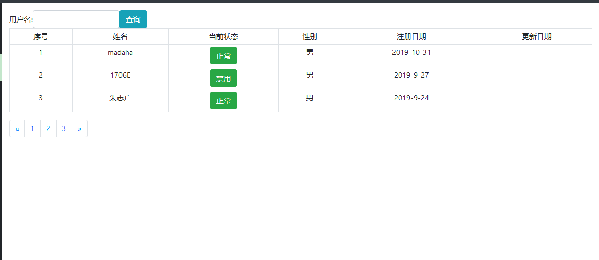

>   实现功能包含根据用户名称进行模糊查询、分页、注册账号的解禁和封禁等。

### 前端

-   列表的显示

>   后端数据存放在request中，在jsp中渲染。代码参考如下：

>   \<table class=*"table table-sm table-hover table-bordered "*\>

>   \<thead class=*"thead-light"*\>

>   \<tr align=*"center"*\>

>   \<td\>序号\</td\>

>   \<td\>姓名\</td\>

>   \<td\>当前状态\</td\>

>   \<td\>性别\</td\>

>   \<!-- \<td\>出生日期\</td\> --\>

>   \<td\>注册日期\</td\>

>   \<td\>更新日期\</td\>

>   \</tr\>

>   \</thead\>

>   \<c:forEach items=*"*\${pageuser.list}*"* var=*"u"* varStatus=*"index"*\>

>   \<tr align=*"center"*\>

>   \<td\>\${index.index+1 }\</td\>

>   \<td\>\${u.username}\</td\>

>   \<td\>\<button type=*"button"* class=*"btn btn-success"*
>   onclick=*"moption('*\${u.id}*',this)"*\>\${u.locked=="0"?"正常":"禁用"}\</button\>\</td\>

>   \<td\>\${u.gender==0?"女":"男"}\</td\>

>   \<%-- \<td\>\${u.birthday}\</td\> --%\>

>   \<td\>

>   \<fmt:formatDate value=*"*\${u.createTime}*"* /\>

>   \<%-- \<c:if test="\${u.createTime!=null}"\>*\</c:if\>* --%\>

>   \</td\>

>   \<td\>\<fmt:formatDate value=*"*\${u.updateTime}*"* /\>\</td\>

>   \</tr\>

>   \</c:forEach\>

>   \</table\>

-   搜索

>   搜索输入的显示使用如下代码

>   \

>   \<label for=*"username"*\>用户名:\</label\> \<input id=*"username"*
>   type=*"text"*

>   name=*"username"* value=*"*\${username }*"* class=*"form-control "*\>

>   \<button type=*"button"* class=*"btn btn-info"*
>   onclick="query()"\>查询\</button\>

>   \</div\>

>   搜索js代码实现如下：

>   /\*\*

>   \* 根据用户名模糊查找用户

>   \*/

>   **function** query(){

>   //在中间区域显示地址的内容

>   \$('\#content-wrapper').load("/user/list?name="+\$("[name='username']").val());

}

-   分页

>   利用工具类在后台实现分页的html代码，前台直接引用。

>   \<div\>

\${pageStr}

>   \</div\>

>   工具类参考工具类一节。

-   封禁与解禁

>   解禁或封禁需要使用js发送ajax请求，处理成功刷新当前求改的数据。

>   Js代码参考如下：

>   /\*\*

>   \* 解禁或封禁

>   \* userid 用户id

>   \* obj dom对象

>   \*/

>   **function** moption(userid,obj){

>   \$.ajax({

>   type:"post",

>   data:{id:userid,locked:\$(obj).text()=="正常"?1:0},

>   url:"/user/update",

>   success:**function**(flag){

>   **if**(flag){

>   \$(obj).text(\$(obj).text()=="正常"?"禁用":"正常");

>   }

>   }

>   })

>   }

### 后端

-   控制层

-   查询列表

>   代码参考如下

>   /\*\*

>   \*

>   \* **\@param** request

>   \* **\@param** name 模糊查询条件

>   \* **\@param** pageNumber 页码

>   \* **\@param** pageSize 每页大小

>   \* **\@return**

>   \*/

>   \@RequestMapping("list")

>   **public** String list(HttpServletRequest request,

>   \@RequestParam( defaultValue="") String name,

>   \@RequestParam(value="page",defaultValue="1") **int** pageNumber,

>   \@RequestParam(defaultValue="3") **int** pageSize) {

>   PageInfo\<User\> users = userService.search(pageNumber,pageSize,name);

>   String pageStr = PageUtil.*page*(users.getPageNum(), users.getPages(),
>   "/user/list", users.getPageSize());

>   request.setAttribute("pageStr", pageStr);

>   request.setAttribute("pageuser", users);

>   **return** "admin/user/list";

>   }

-   解禁与封禁

>   代码参考如下：

>   /\*\*

>   \* 修改用户的状态

>   \* **\@param** request

>   \* **\@param** id

>   \* **\@param** locked 是否封禁

>   \* **\@return**

>   \*/

>   \@RequestMapping("update")

>   \@ResponseBody

>   **public boolean** update(HttpServletRequest request,Integer id,Integer
>   locked) {

>   **return** userService.updateLocked(id,locked)\>0;

>   }

-   业务层

-   查询列表

>   /\*\*

>   \* 根据用户名模糊查询

>   \* **\@param** pageNumber

>   \* **\@param** pageSize

>   \* **\@param** name

>   \* **\@return**

>   \*/

>   PageInfo\<User\> search(**int** pageNumber, **int** pageSize, String name){

>   // **TODO** Auto-generated method stub

>   PageHelper.*startPage*(pageNumber,pageSize);

>   List\<User\> users = userMapper.queryList(name);

>   **return new** PageInfo\<User\>(users);

>   }

-   解禁与封禁

>   /\*\*

>   \*

>   \* **\@param** id 用户的id

>   \* **\@param** locked 是否锁定 1 表示锁定 0 表示不锁定

>   \* **\@return**

>   \*/

>   **public int** updateLocked(Integer userId, Integer locked) {

>   // **TODO** Auto-generated method stub

>   **return** userMapper.updateLocked( userId, locked);

>   }

-   数据层

    -   查询用户列表

>   \@Select("select id,username,password,nickname,birthday,gender,"

>   \+ "locked,create_time as createTime,update_time as updateTime,url,"

>   \+ "score,role from cms_user "

>   \+ " where username like concat('%',\#{name},'%') "

>   \+ " order by createTime desc ")

>   \@ResultType(User.**class**)

>   List\<User\> queryList(\@Param("name") String name);

-   封禁与解禁用户

>   /\*\*

>   \* 修改用户的锁定状态

>   \* **\@param** userId

>   \* **\@param** locked

>   \* **\@return**

>   \*/

>   \@Update("update cms_user set locked=\#{locked},update_time=now() WHERE
>   id=\#{userId}")

>   **int** updateLocked(\@Param("userId") Integer userId, \@Param("locked")
>   Integer locked);

前台系统设计
============

用户注册
--------

实现效果要求：

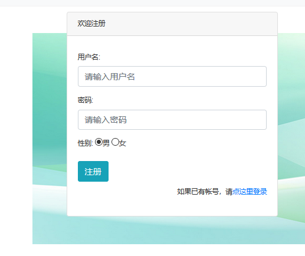

### 前端

实现说明：

使用bootstrap 实现上述jsp页面，使用jqueryValidate 和 hibernate 进行数据校验。

输入：

用户名、密码、性别、点击注册

性别在页面中用数字1、2分别代表男、女。

输出：

注册成功跳转到用户登录页面，否则保持当前页面并提示错误信息。

校验：

-   用户名不能为空

-   密码不能为空

-   用户名不重复

    -   用户名称输入标签中增加属性：

>   *remote*=*"/user/checkExist"，*其中*checkExist*是后端提供的判断用户名是否已经存在的服务接口。

异常处理：

异常跳转到异常显示页面。

### 后端

-   控制层

-   进入注册页面

>   \@GetMapping("register") // 只接受get的请求

**public** String register() {

**return** "user/register";

}

-   注册请求

-   同名用户校验

-   服务层

-   注册

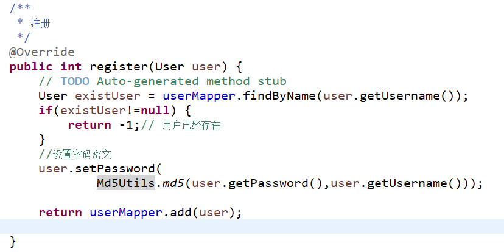

-   判断用户是否存在

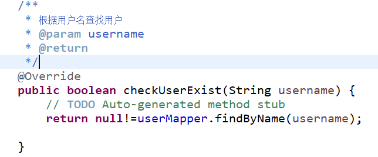

-   工具类

-   前提

>   使用MD5加密引入工具包即可，在此基础之上再封装。Maven工程引入工具包：

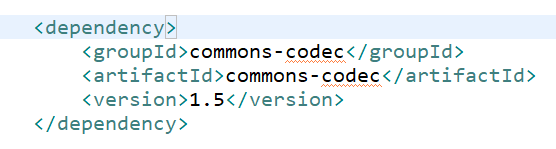

-   MD5加盐加密

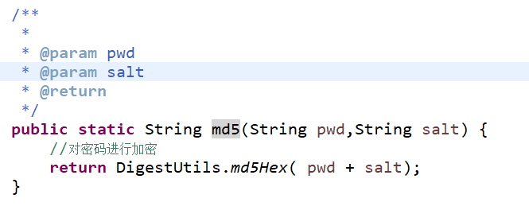

-   数据层

-   根据名称查找用户

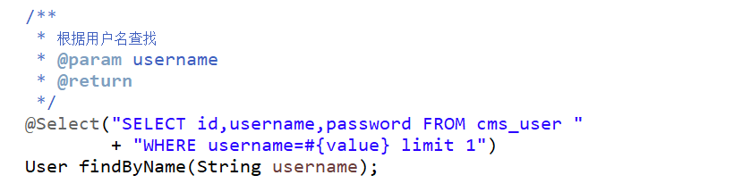

-   添加用户

登录
----

参见后台登录。

登出
----

参见后台登出。

首页
----

首页是最复杂的一部分，首页往往是显示的内容庞杂，相互之间可能没有关联关系。

实现效果如下所示：

### 前端

页面使用bootstrap+ jsp
实现即可。展示的内容包含频道列表、文章分类、文章列表、热门文章、最新文章、轮播图和用户登录状态等，如果需要可以再增加友情链接等等相关内容。

频道列表使用bootstrap 的样式实现，具体代码参考：

>   \<ul class=*"list-group"*\>

>   \<li class=*"list-group-item text-center"*\>\<a class=*"channel"*

>   href=*"/index"*\>热门\</a\>\</li\>

>   。。。。。。。

\</ul\>

分类列表使用使用bootstrap的nav 和nav-item样式实现，具体代码参考：

>   \<ul class=*"nav"*\>

>   \<!--栏目下所有 分类 --\>

>   \<li class=*"nav-item list-group-item-success"*\>\<a class=*"nav-link"*

>   href=*"/index?chnId=*\${chnId}*"*\>全部\</a\>\</li\>

>   \<li class=*"nav-item "*\>\<a class=*"nav-link"*

>   href=*"/index?chnId=1&catId=20"*\>CBA\</a\>\</li\>

>   。。。。。。。。。。。

>   \</ul\>

轮播图参考bootstap官网即可。

用户登录状态

用户如果没有登录，右上角显示注册/登录链接，如果已经登录则显示用户的头像并且可以下拉菜单能够进入个人中心、退出系统等。判断是否登录的方式可以判断session中是否存在用户信息即可。这里的代码实现参考如下：

>   \<ul class=*"nav"*\>

>   \<c:choose\>

>   \<%-- 登录显示用户菜单 --%\>

>   \<c:when test=*"*\${sessionScope.SESSION_USER_KEY != null}*"*\>

>   \<li class=*"nav-item"*\>

>   \<a class=*"nav-link"* href=*"/my/home"*\>

>   \   style="max-height: *2.5rem*" class=*"rounded img-fluid"*\>

>   \</a\>

>   \</li\>

>   \<li class=*"nav-item"*\>

>   \

>   \<a href=*"\#"* class=*"nav-link dropdown-toggle"* role=*"button"*
>   id=*"dropdownMenuButton"* data-toggle=*"dropdown"* aria-haspopup=*"true"*
>   aria-expanded=*"false"*\>

>   \<c:out value=*"*\${sessionScope.SESSION_USER_KEY.username}*"*
>   default=*"CMS-User"*/\>

>   \</a\>

>   \
   aria-labelledby=*"dropdownMenuButton"*\>

>   \<a class=*"dropdown-item"* href=*"/"*\>返回首页\</a\>

>   \<c:if test=*"*\${sessionScope.SESSION_USER_KEY.role==1}*"*\>

>   \<a class=*"dropdown-item"* href=*"/admin/index"*\>后台管理\</a\>

>   \</c:if\>

>   \<c:if test=*"*\${sessionScope.SESSION_USER_KEY.role==0}*"*\>

>   \<a class=*"dropdown-item"* href=*"/user/home"*\>个人主页\</a\>

>   \</c:if\>

>   \<a class=*"dropdown-item"* href=*"\#"*\>个人设置\</a\>

>   \<a class=*"dropdown-item"* href=*"\#"*\>我的文章\</a\>

>   \
\</div\>

>   \<a class=*"dropdown-item"* href=*"/user/logout"*\>退出\</a\>

>   \</div\>

>   \</div\>

>   \</li\>

>   \</c:when\>

>   \<c:otherwise\>

>   \<%-- 未登录显示登录注册链接 --%\>

>   \<li class=*"nav-item"*\>\<a class=*"nav-link"*
>   href=*"/user/register"*\>注册\</a\>\</li\>

>   \<li class=*"nav-item"*\>\<a class=*"nav-link"*
>   href=*"/user/login"*\>登录\</a\>\</li\>

>   \</c:otherwise\>

>   \</c:choose\>

>   \</ul\>

>   \</nav\>

### 后端 

-   控制层

获取首页数据，首页数据的获取包含栏目列表，当前栏目的分类以及当前栏目或分类下的文章列表。

为此定义Controller的函数为：

而函数中的具体实现如下：

-   服务层

在首页中需要调用多个服务，主要有频道、分类、和文章，其中文章需要做分页处理。

-   频道服务

-   分类服务

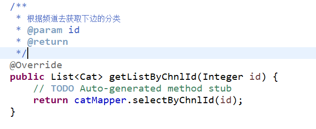

-   文章列表

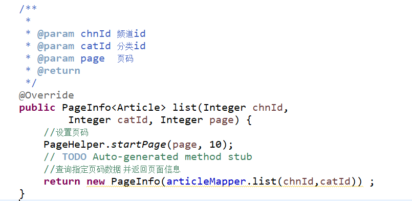

-   热门文章

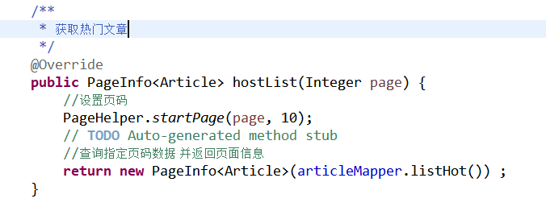

-   获取最新文章

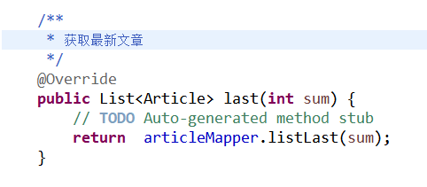

-   数据层

-   频道

-   分类

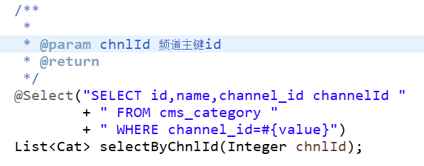

-   文章

>   实体Bean主要属性如下：

>   数据查询接口定义格式为：

>   对应的映射文件以及sql语句

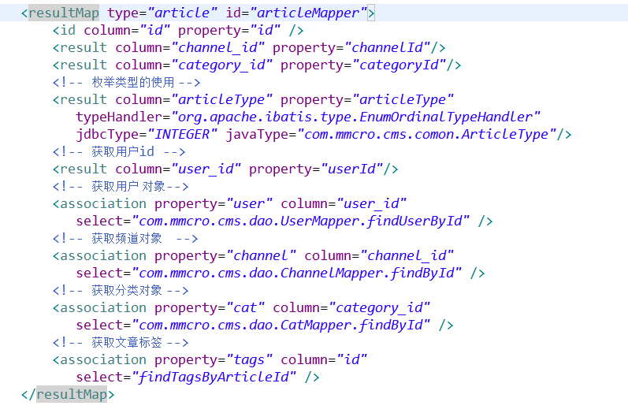

>   根据频道或者分类获取文章列表的sql语句：

>   获取热门文章：

>   获取最新文章：

文章详情
--------

前端
----

>   文章列表中点击文章标题的链接，在新窗口打开文章的详情页面。

-   内容包含

>   标题、作者、内容、发布时间、所属分类以及评论内容和数量等。

-   操作

>   关闭页面

>   发表评论

>   评论翻页

>   具体的实现方式：

关闭页面：

>   \<dt\>\<a href=*"javascript:window.close()"*\>关闭窗口\</a\>\</dt\>

>   评论：

>   显示评论使用异步刷新的方式实现，这里要求评论按照时间倒序排列显示。首先试图代码中创建一个div，在页面的加载完成后js的加载函数中调用使用div的load方法加载评论内容。实现方法如下：

>   Div的写法

>   \<dd\>\
\</div\>\</dd\>

>   预加载的写法：

\$("\#commentList").load("/article/getclist?articleId=\${article.id}" );

>   发表评论使用ajax异步提交的方式实现，在提交发布成功以后需要局部刷新评论内容。具体js代码参考如下：

>   /\*\*

>   \* 发表评论

>   \*/

>   **function** commnent(){

>   //获取评论内容

>   **var** retext=\$("[name='content']").val();

>   //获取评论的id

>   **var** id=\${article.id}

>   //评论内容不为空才可以发表

>   **if**(retext!=""){

>   \$.ajax({

>   type:"post",//请求的方式

>   data:{content:retext,articleId:id},//请求的参数

>   url:"/article/comment",//请求地址

>   success:**function**(msg){ //成功后回调

>   **if**(msg.result==1){

>   alert("发表成功")

>   //刷新评论列表

>   \$("\#commentList").load("/article/getclist?articleId=\${article.id}" );

>   }**else**{

>   //提示失败的原因

>   alert(msg.errorMsg)

>   }

>   }

>   })

>   }**else**{

>   alert("请输入评论内容")

>   }

>   }

1.  后端

    1.  控制层

>   获取文章详情

>   获取文章的评论

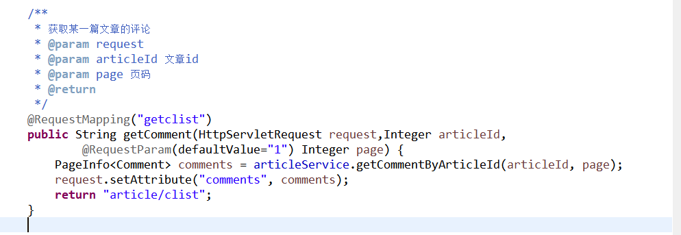

>   发表评论

服务层
------

>   获取文章详情

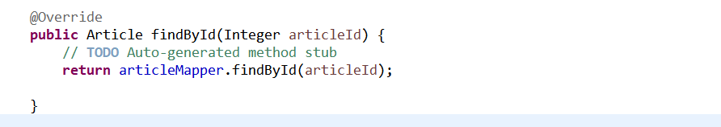

>   获取评论列表

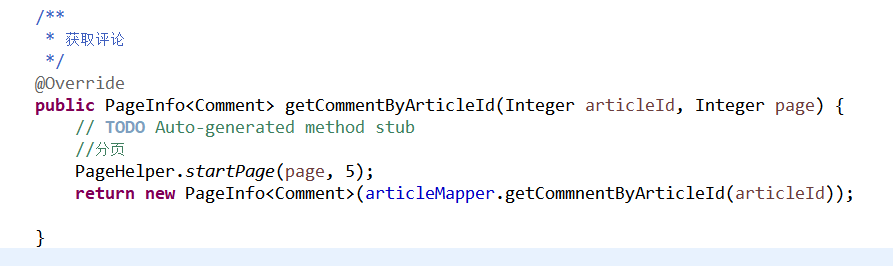

>   发表评论

>   发表评论后，需要对文章的评论数量做自加的操作。

数据层
------

>   文章的实体Bean参考首页，不在赘述。

>   评论的实体Bean主要如下：

>   主要SQL代码参考：

>   文章详情：

>   /\*\*

>   \*

>   \* **\@param** articleId

>   \* **\@return**

>   \*/

>   Article findById(Integer articleId);

>   \<!-- 获取一篇具体文章 --\>

>   \<select id=*"findById"* resultMap=*"articleMapper"*\>

>   SELECT id,title,picture,content,channel_id,category_id,user_id,

>   hits,hot,status,created,updated,commentCnt,articleType

>   FROM cms_article

>   WHERE id=\#{value}

>   AND deleted=0

>   \</select\>

>   添加评论：

>   \@Insert("INSERT INTO cms_comment(userId,articleId,content,created) "

>   \+ "VALUES(\#{userId},\#{articleId},\#{content},now() )")

>   **void** addComment(Comment comment);

>   文章评论数量自增：

>   \@Update(" UPDATE cms_article SET commentCnt=commentCnt+1 WHERE
>   id=\#{value}")

**void** increaseCommentCnt(Integer articleId);

>   获取一篇文章的评论：

>   \@Select("SELECT c.\*,u.username as userName FROM cms_comment c "

>   \+ " LEFT JOIN cms_user u ON u.id=c.userId "

>   \+ " WHERE c.articleId=\#{value} ORDER BY id desc")

>   List\<Comment\> getCommnentByArticleId(Integer articleId);

个人中心
--------

>   个人中心实现效果如下图所示：

>   功能主要包含如下:

>   个人文章管理、发布文章。

发布文章
--------

要求
----

>   发布文章要求内容支持富文本编辑，输入项目包含文章标题、标题图片、文章内容、频道和分类。在频道和分类支持联动效果。

前端
----

>   页面使用bootstrap+jsp实现。富文本编辑使用第三方KindEditor实现。

>   页面加载完成后立即初始化kindEitor 组件，代码如下所示：

>   KindEditor.ready(**function**(K) {

>   window.editor1 = K.create('textarea[name="content1"]', {

>   //指定样式

>   cssPath : '/resource/kindeditor/plugins/code/prettify.css',

>   //指定文件管理器

>   uploadJson : '/resource/kindeditor/jsp/upload_json.jsp',

>   //文件显示

>   fileManagerJson : '/resource/kindeditor/jsp/file_manager_json.jsp',

>   //允许文件上传

>   allowFileManager : **true**,

>   //对象创建完成的回调函数

>   afterCreate : **function**() {

>   **var** self = **this**;

>   K.ctrl(document, 13, **function**() {

>   self.sync();

>   document.forms['example'].submit();

>   });

>   K.ctrl(self.edit.doc, 13, **function**() {

>   self.sync();

>   document.forms['example'].submit();

>   });

>   }

>   });

>   prettyPrint();

>   });

>   文件上传前端代码直接使用如下格式即可：

>   \<input type=*"file"* class=*"form-control"* id=*"file"* name=*"file"*\>

>   联动效果的实现

>   这里的频道内容是固定的，既使用异步加载的方式，也就是在进入页面以后利用ajax技术获取所有的频道内容然后填入到下拉框当中。也可以直接渲染，也就是在进入页面之前在Controller层中获取到所有频道内容，存入到request对象中，jsp渲染的时候从request中获取内容，利用C标签将内容填充到下拉框当中。

>   异步加载实现频道列表下拉代码：

>   //自动加载文章的栏目（频道）

>   \$.ajax({

>   type:"get",//请求方式为get

>   [url:"/article/getAllChn",//](../../小一标准化教案/%22/article/getAllChn%22,/)获取数据的地址

>   success:**function**(list){ //成功后的回调函数

>   \$("\#channel").empty(); //清空下拉框中的数据

>   **for**(**var** i **in** list){ // 对获取到的数据进行遍历

>   \$("\#channel").append("\<option
>   value='"+list[i].id+"'\>"+list[i].name+"\</option\>") // 追加到下拉框中当中

>   }

>   }

>   })

>   直接渲染频道列表下拉代码：

>   \<select class=*"custom-select custom-select-sm mb-3"* id=*"channel"*
>   name=*"channelId"*\>

>   \<option value=*"0"*\>请选择\</option\>

>   \<c:forEach items=*"*\${channels}*"* var=*"channel"*\>

>   \<option value=*"*\${channel.id}*"*\>\${channel.name}\</option\>

>   \</c:forEach\>

>   \</select\>

>   频道与分类实现联动效果：

>   为频道组件绑定change事件，当频道发生改变以后，利用ajax技术获取分类列表，然后清楚分类列表中的内容，最后将重新获取到的分类列表追加到分类列表组件当中。实现的代码如下：

>   //绑定change事件

>   \$("\#channel").change(**function**(){

>   //先清空原有的栏目下的分类

>   \$("\#category").empty();//清空分类列表组件内容

>   **var** cid =\$(**this**).val();//获取当前的下拉框的id 获取改变后的频道id

>   //根据ID 获取栏目下的分类

>   \$.get("/article/listCatByChnl",{chnlId:cid},**function**(resultData){

>   **if**(resultData.result==1){//后台数据处理成功

>   **var** list = resultData.data; //得到分类列表

>   **for**(**var** i **in** list){ //遍历分类列表

>   **//将分类列表追加到分类组件当中**

>   \$("\#category").append("\<option
>   value='"+list[i].id+"'\>"+list[i].name+"\</option\>")

>   }

>   }

>   })

>   })

>   发布文章内容：

>   **function** publish(){

>   //序列化表单数据带文件

>   **var** formData = **new** FormData(\$( "\#form" )[0]);

>   //改变formData的值

>   //editor1.html() 是富文本的内容

>   formData.set("content",editor1.html());

>   \$.ajax({

>   type:"post",

>   data:formData,

>   // 告诉jQuery不要去处理发送的数据

>   processData : **false**,

>   // 告诉jQuery不要去设置Content-Type请求头

>   contentType : **false**,

>   url:"/article/add",

>   success:**function**(obj){

>   **if**(obj){

>   alert("发布成功!")

>   // 发布成功后跳转到我的文章列表页面

>   \$('\#center').load("/user/myarticlelist");

>   }**else**{

>   alert("发布失败")

>   }

>   }

>   })

后端
----

-   工具包依赖

>   项目pom.xml 文件中增加如下属性和依赖：

>   \<!-- 定义主要版本号 --\>

>   \<properties\>

>   \<commons-io.version\>1.3.1\</commons-io.version\>

>   \<commons-fileupload.version\>1.3.1\</commons-fileupload.version\>

>   \</properties\>

>   \<!-- 上传组件包 --\>

>   \<dependency\>

>   \<groupId\>commons-*fileupload*\</groupId\>

>   \<artifactId\>commons-*fileupload*\</artifactId\>

>   \<version\>\${commons-fileupload.version}\</version\>

>   \</dependency\>

>   \<dependency\>

>   \<groupId\>commons-*io*\</groupId\>

>   \<artifactId\>commons-*io*\</artifactId\>

>   \<version\>\${commons-io.version}\</version\>

>   \</dependency\>

-   配置文件

>   spring-mvc.xml 文件需要配置如下内容，用于处理文件的上传。

>   \<!-- 上传下载配置 --\>

>   \<bean id=*"multipartResolver"*
>   class=*"org.springframework.web.multipart.commons.CommonsMultipartResolver"*\>

>   \<property name=*"defaultEncoding"* value=*"utf-8"*\>\</property\>

>   \<property name=*"maxUploadSize"* value=*"10485760000"*\>\</property\>

>   \</bean\>

-   控制层

    -   进入发布页面

>   /\*\*

>   \* 跳转到添加的页面

>   \* **\@param** request

>   \* **\@return**

>   \*/

>   \@RequestMapping(value = "add",method=RequestMethod.*GET*)

>   **public** String add(HttpServletRequest request) {

>   **// 获取所有的频道**

>   List\<Channel\> allChnls = chanService.getAllChnls();

>   request.setAttribute("channels", allChnls);

>   **return** "article/publish";

>   }

-   获取文章频道列表

>   /\*\*

>   \* 获取所有的频道

>   \* **\@return**

>   \*/

>   \@RequestMapping("getAllChn")

>   \@ResponseBody

>   **public** List\<Channel\> getAllChn() {

>   List\<Channel\> channels = channelService.getChannels();

>   **return** channels;

>   }

-   获取文章分类列表

>   /\*\*

>   \* 根据频道获取相应的分类 用户发布文章或者修改文章的下拉框

>   \* **\@param** chnlId 频道id

>   \* **\@return**

>   \*/

>   \@RequestMapping(value="listCatByChnl",method=RequestMethod.*GET*)

>   \@ResponseBody

>   **public** ResultMsg getCatByChnl(**int** chnlId){

>   CmsAssertJson.*Assert*(chnlId\>0,"频道id必须大于0");

>   List\<Cat\> chnlList = catService.getListByChnlId(chnlId);

>   **return new** ResultMsg(1, "获取数据成功", chnlList);

>   }

-   发布文章请求

>   发布文章需要处理上传文件和文章的发布用户。

>   处理文件上传的代码为：

>   /\*\*

>   \* 处理文章的附件上传

>   \* **\@param** file

>   \* **\@param** article

>   \* **\@throws** IOException

>   \* **\@throws** IllegalStateException

>   \*/

>   **private void** processFile(MultipartFile file,Article article)

>   **throws** IllegalStateException, IOException {

>   // 判断原文件的合法性

>   **if**(file.isEmpty()\|\|"".equals(file.getOriginalFilename())

>   \|\| file.getOriginalFilename().lastIndexOf('.')\<0 ) {

>   article.setPicture("");

>   **return**;

>   }

>   //获取原文件名称

>   String originName = file.getOriginalFilename();

>   //获取扩展名

>   String suffixName = originName.substring(originName.lastIndexOf('.'));

>   //根据日期获取存放文件的相对路径名

>   SimpleDateFormat sdf= **new** SimpleDateFormat("yyyyMMdd");

>   //计算文件存放的绝对路径

>   String path = uploadPath + "/" + sdf.format(**new** Date());

>   File pathFile = **new** File(path);

>   //如果路径不存在，则创建文件夹

>   **if**(!pathFile.exists()) {

>   pathFile.mkdir();

>   }

>   //计算文件存放位置以及文件名称

>   String destFileName = path + "/" + UUID.*randomUUID*().toString() +
>   suffixName;

>   File distFile = **new** File( destFileName);

>   file.transferTo(distFile);//文件另存到这个目录下边

>   //文章中保存相对路径

>   article.setPicture(destFileName.substring(uploadPath.length()+1));

>   }

>   处理文章内容上传部分需要考虑从session获取当前用户，当前用户的id存入文章对象的作者字段中。然后调用服务层发布文章成功，代码为：

>   /\*\*

>   \* 处理发布文章请求

>   \* **\@param** request

>   \* **\@param** article

>   \* **\@param** file

>   \* **\@return**

>   \* **\@throws** IllegalStateException

>   \* **\@throws** IOException

>   \*/

>   \@RequestMapping(value = "add",method=RequestMethod.*POST*)

>   **public boolean** add(HttpServletRequest request,Article article,

>   MultipartFile file) **throws** IllegalStateException, IOException {

>   //处理标题图片

>   processFile(file,article);

>   //获取作者

>   User loginUser =
>   (User)request.getSession().getAttribute(ConstClass.*SESSION_USER_KEY*);

>   article.setUserId(loginUser.getId());

>   //发布文章

>   **return** articleService.add(article)\>0;

>   }

-   服务层

    -   获取频道

>   略

-   获取分类

>   略

-   发布文章

>   略

-   数据层

    -   获取频道

>   \@Select("select \* from cms_channel order by id")

>   \@ResultType(Channel.**class**)

>   List\<Channel\> getChannels();

-   获取分类

>   /\*\*

>   \* 根据频道获取分类

>   \* **\@param** cid

>   \* **\@return**

>   \*/

>   \@Select("SELECT id,name,channel_id channelId FROM cms_category "

>   \+ "WHERE channel_id = \#{value} ")

>   List\<Category\> getCategoryByChId(Integer cid);

-   发布文章

>   发布文章中发布时间直接使用书库服务器的系统时间；

>   发布文章要求返回自动生成的主键id；

>   具体的数据层代码为：

>   \<!-- 添加文章 EnumOrdinalTypeHandler 是对枚举的处理--\>

>   \<insert id=*"add"* useGeneratedKeys=*"true"* keyColumn=*"id"*
>   keyProperty=*"id"*\>

>   INSERT INTO
>   cms_article(title,content,picture,channel_id,category_id,user_id,hits,hot,

>   status,deleted,created,updated,commentCnt,articleType)

>   values(\#{title},\#{content},\#{picture},\#{channelId},\#{categoryId},\#{userId},0,

>   0,0,0,now(),now(),0,

>   \#{articleType, typeHandler=org.apache.ibatis.type.EnumOrdinalTypeHandler,

>   jdbcType=INTEGER, javaType=com.mmcro.cms.comon.ArticleType})

\</insert\>

我的文章
--------

>   实现效果如图所示：

#### 前端

>   前端内容显示包含文章列表，其中每一条数据中显示内容包含标题图片、标题、发布时间、频道以及页码。显示顺序要求按照发表时间倒叙排列。

>   功能包含查看文章详情和删除文章。

>   分页显示部分代码的为：

>   \<ul class="pagination"\>

>   \<li class="page-item"\>

>   \<a class="page-link" href="javascript:void(0)" data="1"
>   aria-label="Previous"\>

>   \«\</span\>\</a\>

>   \</li\>

>   \</ul\>

为分页绑点点击事件的js代码为：

>   \$(**function**(){

>   \$('.page-link').click(**function** (e) {

>   //获取点击的的*url*

>   **var** url = \$(**this**).attr('data');

>   //在中间区域显示地址的内容

>   \$('\#content-wrapper').load(url);

>   });

>   })

>   删除文章功能要求删除后能够自动刷新当前的列表，不必考虑删除后的分页问题，也就是删除后只需要跳转到第一页即可。

#### 后端

-   控制层

    -   文章列表

>   我的文章列表部分需要先获取当前用户id，然后根据用户id查询相应的文章列表。页码参数默认值为1。

>   /\*\*

>   \* 进入个人中心 获取我的文章

>   \* **\@param** request

>   \* **\@return**

>   \*/

>   \@RequestMapping("myarticlelist")

>   **public** String myarticles(HttpServletRequest request,

>   \@RequestParam(defaultValue="1") Integer page) {

>   // 获取当前用户信息

>   User loginUser =(User)
>   request.getSession().getAttribute(ConstClass.*SESSION_USER_KEY*);

>   //获取一页文章

>   PageInfo\<Article\> pageArticles =
>   articleService.listArticleByUserId(loginUser.getId(),page);

>   //利用工具类生成页码信息

>   PageUtils.*page*(request, "/user/myarticlelist", 10,

>   pageArticles.getList(), (**long**)pageArticles.getSize(),

>   pageArticles.getPageNum());

>   request.setAttribute("pageArticles", pageArticles);

>   **return** "/my/list";

}

-   删除文章

>   只能删除自己的文章，删除他人文章需要报异常。

>   /\*\*

>   \* 删除用户自己的文章

>   \* **\@param** id 文章id

>   \* **\@return**

>   \*/

>   \@RequestMapping("delArticle")

>   \@ResponseBody

>   **public boolean** delArticle(HttpServletRequest request,Integer id) {

>   //判断文章是否存在

>   Article article = articleService.findById(id);

>   **if**(article==**null**)

>   **return false**;

>   //判断文章是否属于自己的

>   User loginUser =(User) request.getSession().getAttribute(

>   ConstClass.*SESSION_USER_KEY*);

>   **if**(loginUser.getId()!= article.getUserId()) {

>   **return false**;

>   }

>   //删除文章

>   **return** articleService.remove(id)\>0;

>   }

-   服务层

    -   获取文章列表

>   /\*\*

>   \* 根据用户id查找文章列表

>   \* **\@param** id 用户id

>   \* **\@param** page

>   \* **\@return**

>   \*/

>   \@Override

>   **public** PageInfo\<Article\> listArticleByUserId(Integer userId, Integer
>   page) {

>   // **TODO** Auto-generated method stub

>   //设置分页

>   PageHelper.*startPage*(page, 10);

>   //返回分页数据

>   **return new** PageInfo\<Article\>(articleMapper.listByUserId(userId));

>   }

-   删除文章

>   /\*\*

>   \* 删除文章

>   \* **\@param** id 文章id

>   \* **\@return**

>   \*/

>   \@Override

>   **public int** remove(Integer id) {

>   // **TODO** Auto-generated method stub

>   **int** result = articleMapper.deleteById(id);

>   // 删除中间表，如果还有其他需要继续处理，如评论等。。。。

>   // 这里按照实际情况处理即可

>   articleMapper.delTagsByArticleId(id);

>   **return** result;

>   }

-   数据层

    -   我的文章列表

>   \<!-- 根据用户id查找文章 根据发表的时间倒叙排列--\>

>   \<select id=*"listByUserId"* resultMap=*"articleMapper"*\>

>   SELECT id,title,picture,user_id,channel_id,category_id,

>   hits,hot,status,created,updated,commentCnt

>   FROM cms_article

>   WHERE user_id=\#{value}

>   AND deleted=0

>   ORDER BY id desc

>   \</select\>

-   删除文章

>   删除文章使用逻辑删除，也就是文章内容依然保存在数据库当中。

>   /\*\*

>   \* 根据文章id删除文章

>   \* **\@param** id

>   \* **\@return**

>   \*/

>   \@Update("UPDATE cms_article SET deleted=1 WHERE id=\#{value} ")

>   **int** deleteById(Integer id);

文章修改
--------

前端
----

>   与添加文章页面类似，但是需要数据回显。这里数据回显的难点是下拉框联动的数据回显和页面中文章内容的回显。

-   文章内容的回显

>   首先使用java代码对文章内容进行如下处理，用于特殊字符的转义，以便数据能在页面正常显示，这里的代码可以写在控制层或jsp页面中。

>   **private** String htmlspecialchars(String str) {

>   str = str.replaceAll("&", "\&amp;");

>   str = str.replaceAll("\<", "\&lt;");

>   str = str.replaceAll("\>", "\&gt;");

>   str = str.replaceAll("\\"", "\&quot;");

>   **return** str;

>   }

>   将得到的数据显示在jsp页面中。

>   \

>   \<textarea name=*"content1"* cols=*"100"* rows=*"8"*

>   style="width: *860px*; height: *250px*; visibility: *hidden*;"
>   \>\<%=htmlspecialchars(htmlData)%\>\</textarea\>

>   \ 

\</div\>

-   频道回显

>   频道内容在进入修改页面的时候，控制层将数据存储在request中，jsp页面利用c标签循环遍历显示，如果某项频道数据的id恰好等于被修改文章的频道id属性值，则将该项数据指定为选中状态。代码实现格式如下：

>   \

>   \<label for=*"channel"*\>文章栏目\</label\>

>   \<select class=*"custom-select custom-select-sm mb-3"* id=*"channel"*
>   name=*"channelId"*\>

>   \<option value=*"0"*\>请选择\</option\>

>   \<c:forEach items=*"*\${channels}*"* var=*"channel"*\>

>   \<option value=*"*\${channel.id}*"*
>   \${channel.id==article.channelId?"selected":""} \>
>   \${channel.name}\</option\>

>   \</c:forEach\>

>   \</select\>

>   \</div\>

-   分类回显

>   分类列表与频道列表要进行联动，也就是当频道选中一条数据以后，分类列表内容需要进行相应的改变，这一点与添加文章内容的处理方式完全相同。由于修改文章需要回显，所以在jsp页面加载完成后就需要根据文章的频道获取该频道下的所有分类列表，实现该功能需要使用ajax技术进行局部刷新跟新分类内容，并且刷新分类的同时选中文章中的分类。具体实现代码参考如下：

>   /\*\*

>   \* 函数用于根据频道内容获取分类列表内容

>   \*

>   \*/

>   **function** changeChannel(){

>   //先清空原有的栏目下的分类

>   \$("\#category").empty();

>   **var** cid =\$("\#channel").val();//获取当前的下拉框的id

>   //根据ID 获取栏目下的分类

>   \$.get("/article/listCatByChnl",{chnlId:cid},**function**(resultData){

>   **if**(resultData.result==1){ //后端处理正确

>   **var** list = resultData.data; //得到分类列表的数据

>   //遍历分类列表数据

>   **for**(**var** i **in** list){

>   //该分类就是文章的分类

>   **if**(list[i].id==\${article.categoryId}){

>   // 该项处于选中状态

>   \$("\#category").append("\<option value='"+list[i].id

>   \+"' selected \>"+list[i].name+"\</option\>")

>   }**else**{

>   //

>   \$("\#category").append("\<option value='"+list[i].id+"'\>"

>   \+list[i].name+"\</option\>")

>   }//end if

>   }//end for

>   }//end if

>   })// end \$.get(

}//end function

>   /\*\*

>   \* 预加载函数

>   \*/

\$(**function**(){

>   //根据频道获取分类

>   changeChannel();

>   //为栏目添加绑定事件 触发联动

>   \$("\#channel").change(**function**(){

>   changeChannel();

>   }) // end of change

})//end \$(function

-   文章id处理

>   在form中添加隐藏变量，以便提交更新数据的时候可以把文章id一起提交到后端。参考代码如下：

>   \<input type=*"hidden"* value=*"*\${article.id}*"* name=*"id"*\>

-   数据提交

>   代码参考添加文章，只要将其中的提交地址修改如下地址即可：

>   [url:"/article/update](../../小一标准化教案/%22/article/update)",

### 后端

-   控制层

>   进入修改页面

>   /\*\*

>   \* 跳转到修改的页面

>   \* **\@param** request

>   \* **\@return**

>   \*/

>   \@RequestMapping(value = "update",method=RequestMethod.*GET*)

>   **public** String update(HttpServletRequest request,Integer id) {

>   //获取频道

>   List\<Channel\> allChnls = chanService.getAllChnls();

>   //获取文章

>   Article article = articleService.findById(id);

>   //

>   request.setAttribute("article", article);

>   request.setAttribute("content1", article.getContent());

>   request.setAttribute("channels", allChnls);

>   **return** "my/update";

>   }

>   处理提交请求，需要判断文章的存在性、是否登录以及该文是否属于当前用户。具体代码参考如下：

>   /\*\*

>   \*

>   \* **\@param** request

>   \* **\@param** article

>   \* **\@param** file

>   \* **\@return**

>   \* **\@throws** IllegalStateException

>   \* **\@throws** IOException

>   \*/

>   \@RequestMapping(value = "update",method=RequestMethod.*POST*)

>   \@ResponseBody

>   **public boolean** update(HttpServletRequest request,

>   Article article, MultipartFile file)

>   **throws** IllegalStateException, IOException {

>   //获取作者

>   User loginUser =
>   (User)request.getSession().getAttribute(ConstClass.*SESSION_USER_KEY*);

>   //尚未登录

>   **if**(loginUser == **null**) {

>   **return false**;

>   }

>   //获取原来的文章

>   Article srcArticle = articleService.findById(article.getId());

>   //原来文章存在

>   **if**(srcArticle == **null**) {

>   **return false**;

>   }

>   //原文的作者不是当前的登录用户

>   **if**(srcArticle.getUserId()!= loginUser.getId()) {

>   **return false**;

>   }

>   //处理上传文件

>   processFile(file,article);

>   //调用服务层保存修改后的文章数据

>   **int** result = articleService.update(article);

>   **return** result \> 0;

>   }

-   服务层

>   /\*\*

>   \* 修改文章

>   \* **\@param** article

>   \* **\@return**

>   \*/

>   \@Override

>   **public int** update(Article article) {

>   // **TODO** Auto-generated method tub

>   **int** result = articleMapper.update(article);

>   // 删除中间表中的

>   articleMapper.delTagsByArticleId(article.getId());

>   // 处理文章的标签

>   processTag(article);

>   **return** result;

>   }

-   数据层

>   代码参考如下：

>   /\*\*

>   \* 修改文章

>   \* **\@param** article

>   \* **\@return**

>   \*/

>   \@Update("UPDATE cms_article set title=\#{title},content=\#{content},"

>   \+ " picture=\#{picture},channel_id=\#{channelId},"

>   \+ "category_id=\#{categoryId},updated=now() "

>   \+ " WHERE id=\#{id}")

>   **int** update(Article article);
